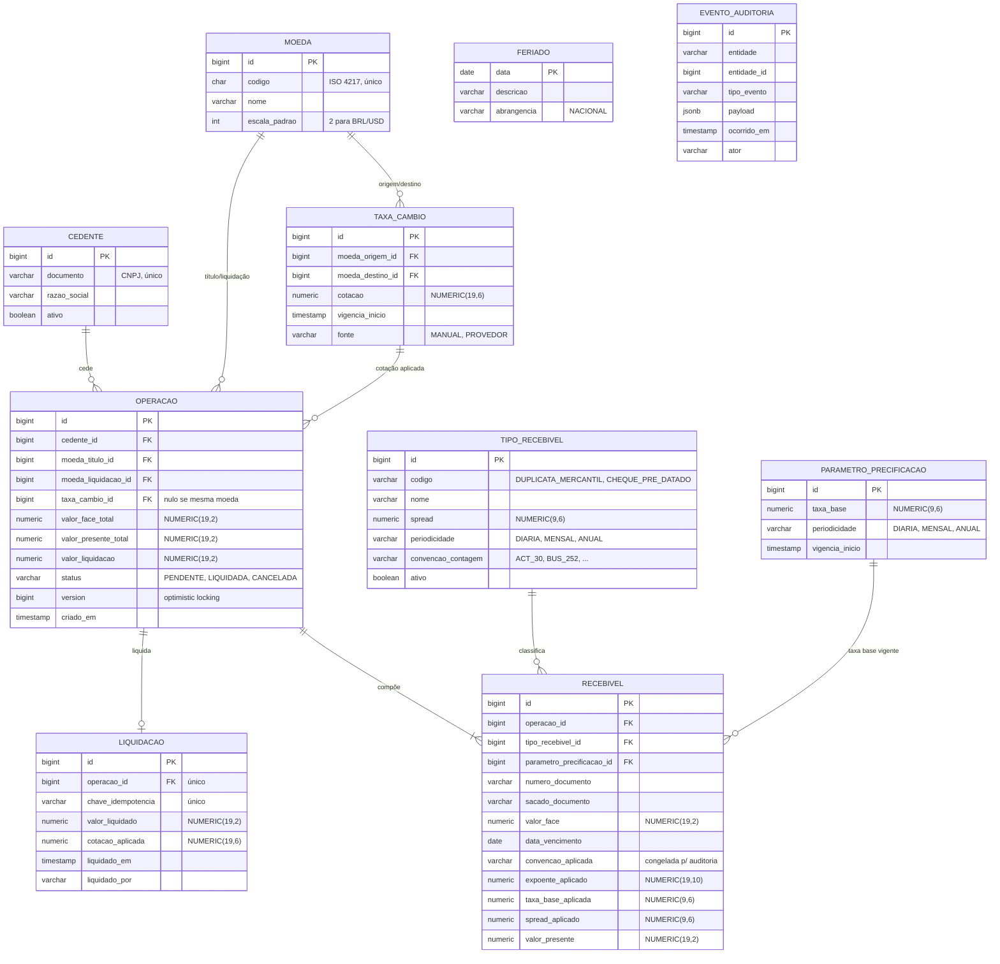
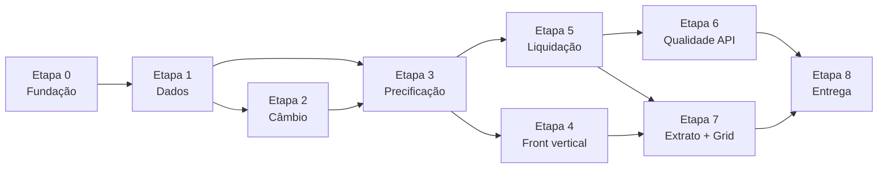

# Backlog — SRM Credit Engine

> Plataforma de cessão de crédito multimoedas para FIDC.
> Backlog executável derivado de [`README_case_dev_srm.md`](./README_case_dev_srm.md).
>
> Decompõe um único épico — o SRM Credit Engine — em 45 PBIs sequenciados em 9 etapas. Carrega também o glossário de domínio, o modelo de dados preliminar, os critérios de aceite não-funcionais, os riscos e as convenções de trabalho; as seções marcadas com **fonte e destino** são extraídas para documentos próprios pelos PBIs correspondentes.

| | |
|---|---|
| **Nível-alvo** | 🔴 Sênior (cumulativo: Júnior + Pleno + Sênior) |
| **Prazo nominal** | 3 a 4 dias úteis (§9.2 do enunciado, ajustável) |
| **Escopo decidido** | **Cenário A — Sênior completo, sem cortes.** ~78,5 h ≈ 9,8 dias úteis — ver [§6.1](#61-orçamento-de-esforço-e-decisão-de-escopo) |
| **Repositório** | https://github.com/edilenos/credit-engine |
| **Stack** | Spring Boot 4.1 / Java 21 / PostgreSQL 17 / Flyway · Next.js 16 / React 19 / TypeScript |
| **Total de PBIs** | 45, distribuídos em 9 etapas |

---

## Índice

1. [Visão de negócio](#1-visão-de-negócio)
2. [Glossário de domínio](#2-glossário-de-domínio)
3. [Escopo, fora de escopo e premissas](#3-escopo-fora-de-escopo-e-premissas)
4. [Modelo de domínio preliminar](#4-modelo-de-domínio-preliminar)
5. [Matriz de rastreabilidade](#5-matriz-de-rastreabilidade)
6. [Estratégia de entrega em etapas](#6-estratégia-de-entrega-em-etapas)
7. [PBIs detalhados](#7-pbis-detalhados)
8. [Critérios de aceite não-funcionais](#8-critérios-de-aceite-não-funcionais)
9. [Definition of Ready / Definition of Done](#9-definition-of-ready--definition-of-done)
10. [Convenções de Git](#10-convenções-de-git)
11. [Riscos e mitigações](#11-riscos-e-mitigações)
12. [Checklist final de entrega](#12-checklist-final-de-entrega)

---

## 1. Visão de negócio

A SRM Asset opera FIDCs que adquirem direitos creditórios de empresas cedentes, antecipando liquidez ao mercado. Com a internacionalização da carteira, o fundo passou a manter caixa em BRL e USD, e a mesa de operações precisa de um sistema que faça três coisas com precisão auditável:

1. **Precificar** um lote de recebíveis, aplicando o deságio correspondente ao risco de cada tipo de ativo.
2. **Converter** o resultado quando a operação é cross-currency (título emitido em uma moeda, liquidação em outra).
3. **Liquidar** a operação de forma transacional, sem estados intermediários e sem race condition, deixando trilha para auditoria.

**Objetivo do épico:** entregar o SRM Credit Engine com API e SPA funcionais, precisão decimal garantida, integridade transacional sob concorrência, e o ferramental de engenharia (Docker, CI, observabilidade, testes) que sustenta um sistema financeiro em produção.

**Critérios de sucesso**, espelhando a seção 8 do enunciado:

| Critério avaliado | Como esta entrega endereça |
|---|---|
| Fundamentação teórica | Decisões de stack e biblioteca justificadas no README (PBI-43) |
| Design de código | Strategy para spread, camadas explícitas, relatório em 2 camadas |
| Domínio do Git | Branch por PBI, Conventional Commits, PRs descritos, histórico linear, tag semver |
| Domínio do negócio | `BigDecimal` ponta a ponta, ordem de aplicação do câmbio, optimistic locking, auditoria |
| Uso da IA | `AI_USAGE.md` como documento vivo, com falhas reais registradas |
| Maturidade de system design | C4 L1/L2, logs estruturados, métricas, circuit breaker, CI |

---

## 2. Glossário de domínio

Vocabulário fixo do projeto. Nomes de entidades, endpoints e classes seguem estes termos.

| Termo | Definição |
|---|---|
| **FIDC** | Fundo de Investimento em Direitos Creditórios. O comprador dos recebíveis. |
| **Cedente** | Empresa que vende (cede) o recebível ao fundo em troca de liquidez imediata. |
| **Sacado** | Devedor original do título — quem efetivamente pagará no vencimento. |
| **Recebível / Título** | Direito creditório adquirido. Aqui: duplicata mercantil ou cheque pré-datado. |
| **Duplicata mercantil** | Título de crédito lastreado em venda mercantil. Risco menor — spread de 1,5% a.m. |
| **Cheque pré-datado** | Ordem de pagamento com apresentação futura. Risco maior — spread de 2,5% a.m. |
| **Valor de face** | Valor nominal do título, a ser pago pelo sacado no vencimento. |
| **Prazo** | Tempo entre a operação e o vencimento do título. Vira o expoente da fórmula, normalizado pela convenção de contagem. |
| **Convenção de contagem de dias** | Regra que converte o intervalo entre duas datas no expoente da fórmula. Define como contar o numerador (dias corridos, dias úteis, regra 30/360) e por qual base dividir (30, 252, 360, 365). |
| **Base 252** | Convenção de renda fixa brasileira: dias úteis sobre 252, com taxa cotada ao ano. Padrão de ativos indexados ao CDI. |
| **30/360** | Convenção comercial em que todo mês conta 30 dias e o ano 360, com ajustes de borda para o dia 31. |
| **Periodicidade da taxa** | Unidade de capitalização em que a taxa é cotada — ao dia, ao mês ou ao ano. Precisa casar com a unidade produzida pela convenção de contagem. |
| **Taxa base** | Custo de oportunidade do fundo. Parâmetro global versionado por vigência, com periodicidade própria. |
| **Spread** | Prêmio de risco somado à taxa base, específico do tipo de recebível, com periodicidade própria. |
| **Deságio** | Desconto aplicado ao valor de face. `Deságio = Valor de Face − Valor Presente`. |
| **Valor presente** | Quanto o fundo desembolsa hoje pelo título. `VP = VF / (1 + TaxaBase + Spread)^Prazo`. |
| **Operação / Cessão** | Transação de compra de um lote de recebíveis de um cedente. |
| **Liquidação** | Ato de efetivar financeiramente a operação. Irreversível e único por operação. |
| **Cross-currency** | Operação em que a moeda do título difere da moeda de liquidação. |
| **Cotação** | Taxa de conversão entre um par de moedas, com vigência datada. |

---

## 3. Escopo, fora de escopo e premissas

### 3.1 Dentro do escopo (nível Sênior, cumulativo)

- **Júnior** — API e frontend rodando localmente, lógica de cálculo correta, banco normalizado com diagrama ER, README com instruções de setup, commits atômicos e branch por feature.
- **Pleno** — Conventional Commits, PRs descritos, histórico limpo, Docker e Docker Compose, tratamento global de exceções, validação robusta de input, testes unitários das Strategies.
- **Sênior** — git hooks, tag semver, rebase interativo, diagramas C4 (L1 e L2), logs estruturados e métricas, pipeline de CI rodando testes e linter, retry/circuit breaker em chamada externa, optimistic locking.

### 3.2 Conscientemente fora de escopo

Itens do nível 🟣 Especialista/Staff. A exclusão é deliberada e registrada aqui — omitir sem dizer nada é pior do que declarar a fronteira:

- ADRs formais (Architecture Decision Records)
- Design escrito para 1 milhão de transações/minuto
- Proposta de arquitetura orientada a eventos (EDA)
- IaC (Terraform / manifests Kubernetes)
- Simulação de gestão de crise com `git revert` / `cherry-pick`
- Justificativa formal da estratégia de branching no README

> As decisões técnicas relevantes ficam registradas nos PBIs e no README, o que cobre parcialmente a intenção dos ADRs sem o custo do formato completo.

### 3.3 Premissas

| # | Premissa |
|---|---|
| P1 | A stack já está escolhida e escafoldada. Trocar de stack não está em discussão. |
| P2 | Autenticação e autorização não são exigidas pelo enunciado. A API assume um operador confiável; o campo de auditoria registra o ator informado. |
| P3 | O provedor externo de cotação é mockado — o valor demonstrado é o padrão de resiliência, não a integração real. |
| P4 | Moedas suportadas na entrega: BRL e USD. O modelo é genérico o bastante para outras. |
| P5 | Um lote de recebíveis pertence a um único cedente e a um único par de moedas. |
| P6 | O enunciado não fixa convenção de contagem de dias, e não há regra única no mercado de FIDC. O sistema suporta várias e trata a escolha como política do produto, com `ACT_30` como padrão por ser a que casa com o spread cotado a.m. do enunciado. |
| P7 | O calendário de dias úteis cobre apenas feriados **nacionais** dos anos semeados. Feriado municipal e calendário ANBIMA completo estão fora de escopo, com a limitação declarada no README. |

---

## 4. Modelo de domínio preliminar

> ## ✅ Extraída — esta seção está congelada
> O PBI-07 extraiu e refinou este conteúdo em **[`data-model.md`](data-model.md)**, que é a versão definitiva. Mudança de modelo se faz lá. O que segue permanece como registro da decisão inicial.
>
> O documento extraído acrescenta o que não cabia aqui: dicionário de dados coluna a coluna com tipo, nulidade e `CHECK`, justificativa de precisão e escala por família de coluna, índices com o alerta de que o Postgres não indexa FK automaticamente, diagrama de ciclo de vida da operação, e o que ficou fora de escopo.



**Decisões de modelagem que o diagrama já fixa:**

- **Valores monetários são `NUMERIC(19,2)`; taxas e cotações são `NUMERIC(19,6)` ou `NUMERIC(9,6)`.** Nunca `float`/`double`/`real`, em nenhuma camada.
- **`taxa_cambio` e `parametro_precificacao` são append-only, versionados por `vigencia_inicio`.** Cotação nunca é sobrescrita — a precificação de ontem precisa continuar reproduzível.
- **Taxa e convenção de contagem são acopladas por unidade.** Toda taxa carrega a própria `periodicidade` (`DIARIA`/`MENSAL`/`ANUAL`) e toda convenção declara a unidade que produz. `(1 + taxa)^expoente` só é válido quando as duas batem — combinar spread a.m. com base 252 não estoura exceção, produz preço errado por ordem de grandeza. Por isso `spread_mensal` virou `spread` + `periodicidade`, e o motor valida o par antes de calcular (PBI-19).
- **O recebível congela a convenção e o expoente aplicados**, não o prazo em meses. Com convenções múltiplas, "prazo em meses" deixa de ser representação suficiente — o mesmo intervalo de datas produz expoentes diferentes conforme a convenção.
- **Todo parâmetro de cálculo é gravado duas vezes: como FK e como valor.** A operação referencia `taxa_cambio_id` e também grava a cotação; o recebível referencia `parametro_precificacao_id` e também grava `taxa_base_aplicada` e `spread_aplicado`. A FK dá a linhagem (qual registro foi usado), o valor dá a imutabilidade (quanto ele valia). Recalcular no futuro com parâmetros novos daria outro resultado — a auditoria exige o número congelado no momento da operação.
- **`operacao.version`** habilita o optimistic locking da liquidação.
- **`liquidacao.operacao_id` é único** — o banco, não só o código, garante que não existe liquidação dupla.

---

## 5. Matriz de rastreabilidade

Prova de que nenhum requisito do enunciado ficou órfão.

| Requisito (§ do enunciado) | PBIs |
|---|---|
| §2 — `AI_USAGE.md` | PBI-06, PBI-44 |
| §3.1 — Gestão de câmbio | PBI-13, PBI-14, PBI-15, PBI-16 |
| §3.2 — Motor de precificação (Strategy) | PBI-17, PBI-18, PBI-21, PBI-22, PBI-23, PBI-24 |
| §3.2 — Convenção de contagem de dias (Strategy) | PBI-19, PBI-20 |
| §3.2 — Conversão cambial ao final | PBI-22 |
| §3.3 — Persistência relacional e ACID | PBI-08, PBI-09, PBI-11, PBI-27, PBI-28 |
| §3.3 — Race conditions | PBI-28, PBI-29 |
| §3.4 — API RESTful, verbos e status | PBI-14, PBI-24, PBI-27, PBI-28 |
| §3.4 — OpenAPI/Swagger | PBI-33 |
| §3.5 — Extrato de liquidação com filtros | PBI-35 |
| §3.5 — Query builder / SQL nativo (diferencial) | PBI-35, PBI-36 |
| §3.6 — Três camadas no backend | PBI-11, PBI-21, PBI-27 |
| §3.6 — Relatório em duas camadas | PBI-35 |
| §4.1 — Painel do operador com simulação | PBI-24, PBI-26 |
| §4.2 — Grid com paginação server-side e filtros | PBI-37 |
| §4.3 — Separação UI / lógica de estado | PBI-25 |
| §4.3 — Gerenciamento de estado global (se necessário) | PBI-25 — decisão registrada: não adotar, com gatilho de revisão |
| §5.1 — Tratamento de exceções | PBI-31 |
| §5.2 — Critérios de aceite não-funcionais | PBI-42, §8 deste documento |
| §6 🟢 — Commits atômicos e branching | PBI-04 |
| §6 🟢 — API e frontend rodando localmente | PBI-03, PBI-38 |
| §6 🟢 — Diagrama ER | PBI-07 |
| §6 🟢 — README com "como rodar" | PBI-43 |
| §6 🟡 — Conventional Commits e PRs | PBI-04 |
| §6 🟡 — Histórico limpo | PBI-45 |
| §6 🟡 — Docker e Docker Compose | PBI-03, PBI-38 |
| §6 🟡 — Exception handlers globais | PBI-31 |
| §6 🟡 — Validações de input | PBI-32 |
| §6 🟡 — Testes unitários das Strategies | PBI-23 |
| §6 🔴 — Git hooks | PBI-39 |
| §6 🔴 — Tags semver | PBI-45 |
| §6 🔴 — Rebase interativo | PBI-45 |
| §6 🔴 — Diagrama C4 L1 e L2 | PBI-41 |
| §6 🔴 — Observabilidade | PBI-34 |
| §6 🔴 — CI/CD com testes e linter | PBI-05, PBI-39, PBI-40 |
| §6 🔴 — Retries / circuit breaker | PBI-15 |
| §6 🔴 — Optimistic locking | PBI-28, PBI-29 |
| §7 — Diagrama ER | PBI-07 |
| §7 — Scripts DDL | PBI-12 |
| §3 preâmbulo — stack adequada a ambiente financeiro | PBI-43 |
| §8.1 — Fundamentação teórica (justificar linguagem e bibliotecas) | PBI-43 |
| §8.2 — Design de código (SOLID, DRY, KISS) | PBI-43, ancorado em PBI-18, PBI-19, PBI-25, PBI-35 |
| §9 — Repositório público | PBI-01 |
| §9.2 — Prazo ajustável conforme complexidade | §6.1 deste documento, declarado no README pelo PBI-43 |
| §9.3 — README como "cara do projeto" | PBI-43 |

---

## 6. Estratégia de entrega em etapas

A sequência prioriza uma **fatia vertical demonstrável cedo**: o frontend entra logo depois do motor de precificação (Etapa 4), não no fim. Isso garante que, mesmo se o prazo apertar, existe uma demo ponta a ponta funcionando.



| Etapa | Objetivo | Marco demonstrável | Esforço |
|---|---|---|---|
| **0** | Fundação do repositório e ambiente | `docker compose up -d db` e `./mvnw test` verde, CI rodando no primeiro PR | ~4 h |
| **1** | Modelagem e persistência | Schema criado por Flyway, `ddl-auto: validate` passa, ER publicado | ~8,5 h |
| **2** | Currency Engine | Cadastro e consulta de cotação por vigência, com fallback quando o provedor cai | ~6 h |
| **3** | Motor de precificação | `POST /simulacoes` devolve valor presente correto, sob qualquer convenção de contagem, cross-currency incluso | ~15 h |
| **4** | Fatia vertical do frontend | Painel do operador simulando em tempo real contra a API | ~6 h |
| **5** | Cessão e liquidação | Operação registrada e liquidada com ACID; teste de concorrência provando o lock | ~9 h |
| **6** | Qualidade transversal da API | Swagger navegável, erros padronizados, `/actuator/prometheus` expondo métricas | ~7,5 h |
| **7** | Extrato de liquidação e grid | Extrato filtrado sobre volume alto, com grid paginado no servidor | ~7,5 h |
| **8** | Empacotamento e entrega | `docker compose up` sobe tudo em máquina limpa; tag `v1.0.0` publicada | ~15 h |
| | | **Total** | **~78,5 h ≈ 9,8 dias úteis** |

**Legenda de tamanho:** `P` ~0,5 h · `M` ~1,5 h · `G` ~3 h. Calibrada para take-home, não para produção.

### 6.1 Orçamento de esforço e decisão de escopo

> ## ✅ Decisão fechada: **Cenário A — Sênior completo, os 45 PBIs, ~78,5 h ≈ 9,8 dias úteis.**
> Tomada antes do primeiro commit, invocando a cláusula de ajuste de prazo do §9.2 do enunciado. Precisa ser **declarada no README** (PBI-43): qual cenário, quanto custou, por quê.

Esta seção passou por três correções, todas do mesmo tipo: dois números que deveriam derivar um do outro e não derivavam. Primeiro as etapas somavam 5,5 dias contra outra coisa nos PBIs; depois a tabela de cenários trazia prazos que não vinham das etapas; por fim as Etapas 3 e 7 estavam declaradas acima da soma dos próprios PBIs.

**Invariante, para não repetir:** as horas por etapa são um *rollup* dos tamanhos dos PBIs, nunca um número digitado à parte. A fonte única é o campo `Tamanho` de cada PBI. Conferível a qualquer momento:

```bash
awk 'BEGIN{sz["P"]=0.5;sz["M"]=1.5;sz["G"]=3}
/^#### PBI-/{getline;getline;
  match($0,/\*\*Etapa:\*\* ([0-9]+)/,e); match($0,/\*\*Tamanho:\*\* ([PMG])/,t);
  h[e[1]]+=sz[t[1]]; tot+=sz[t[1]]}
END{for(i=0;i<=8;i++) printf "E%d: %.1f h\n", i, h[i];
    printf "TOTAL: %.1f h = %.1f dias\n", tot, tot/8}' docs/backlog.md
```

| | |
|---|---|
| Prazo nominal do enunciado (§9.2) | 3 a 4 dias úteis = **24 a 32 h** |
| Escopo Sênior completo (45 PBIs) | **~78,5 h ≈ 9,8 dias** |
| Fator de excesso | **2,5× a 3,3×** |

#### Por que a escolha era binária

O exercício MoSCoW classificou **40 dos 45 PBIs como Must** — quase tudo neste enunciado é explicitamente graduado. Os cortáveis são cinco:

| PBI | Prioridade | Tamanho | Ancoragem no enunciado |
|---|---|---|---|
| PBI-16 — Testes do Currency Engine | Should | 1,5 h | Boa prática; o enunciado nomeia testes de Strategy, não de câmbio |
| PBI-19 — Convenções de contagem de dias | Should | 3 h | Além do texto literal, que só escreve `^Prazo` |
| PBI-20 — Calendário e BUS/252 | Could | 1,5 h | Idem, e é a convenção cara |
| PBI-30 — Trilha de auditoria | Should | 1,5 h | §1 pede transação auditável; parcialmente coberto pelos parâmetros congelados |
| PBI-36 — Índices e evidência de performance | Should | 1,5 h | §3.5 chama query otimizada de diferencial; sem `EXPLAIN` a alegação fica solta |
| | | **9 h** | **11% do total** |

**Cortar tudo o que é cortável economiza 9 horas — pouco mais de um dia.** Não existia "Sênior enxuto" como alternativa real: seria o mesmo escopo, um dia antes, com menos profundidade de domínio.

#### Descer de nível também não resgata o prazo

Removendo tudo que é exclusivo do 🔴 Sênior — resiliência (PBI-15), observabilidade (PBI-34), git hooks (PBI-39), C4 (PBI-41), 7,5 h somados — junto com os cinco cortáveis, sobram **~62 h ≈ 7,8 dias**. Uma entrega apenas funcional, sem nenhum extra de senioridade, ainda custa quase **8 dias**.

A conclusão não é sobre este backlog, é sobre o enunciado: **o escopo funcional dos §3 e §4 não cabe em 3-4 dias em nível nenhum.** O grosso do custo está nos requisitos-base — motor de precificação, liquidação transacional, extrato analítico, duas telas, Docker, documentação — não nos adicionais de senioridade. É quase certamente por isso que o §9.2 diz que o prazo é *"ajustável conforme complexidade entregue"*.

#### Consequências da decisão

- **Nada é cortado por padrão.** Os cinco PBIs não-Must entram na entrega.
- **A ordem de corte continua valendo como plano de contingência**, caso algo estoure durante a execução: PBI-20 → PBI-36 → PBI-16 → PBI-30 → PBI-19. Contingência, não plano.
- **O README abre declarando o escopo e o prazo.** Quase dez dias contra um nominal de 3-4 é 2,5× — a cláusula do §9.2 autoriza, mas autorização textual não garante leitura favorável. A defesa é dizer de saída o que foi entregue, quanto custou e por quê, em vez de deixar o avaliador fazer a conta sozinho.

> **Nunca cortar**, mesmo em contingência: paginação server-side, testes de Strategy, optimistic locking, Docker Compose e CI. Todos nomeados explicitamente no enunciado.

---

## 7. PBIs detalhados

### Etapa 0 — Fundação do repositório e ambiente

---

#### PBI-01 — Sanear segredos e higienizar o versionamento

**Etapa:** 0 · **Nível:** 🟢 · **Tipo:** `chore` · **Tamanho:** P · **MoSCoW:** Must · **Depende de:** — · **Origem:** §9
**Branch:** `chore/saneamento-de-segredos`

**História:** Como responsável pela entrega, quero garantir que nenhuma credencial seja publicada, para que o repositório possa ser tornado público sem incidente de segurança.

**Detalhamento:** `apps/api/src/main/resources/application.yaml` traz hoje a senha real do Postgres local como valor padrão de `${DB_PASSWORD:...}`, duplicando exatamente o segredo que o `application-local.yaml` (ignorado) existe para proteger. O arquivo ainda não foi commitado — a correção precisa acontecer antes do primeiro commit real. Também falta um `.gitignore` na raiz: hoje só existem `.gitignore` dentro de `apps/api` e `apps/frontend`, escopados às próprias subárvores.

**Tarefas:**
- Trocar o default de `DB_PASSWORD` por vazio ou placeholder inequívoco
- Rotacionar a senha do Postgres local
- Criar `.gitignore` na raiz (arquivos de IDE, `.env*`, artefatos de SO)
- Criar `apps/api/application-local.yaml.example` versionado como referência de setup
- Rodar `git grep` da senha antiga em todo o histórico para confirmar que nunca vazou

**Critérios de aceite:**
- [ ] Buscar a senha antiga no repositório e no histórico não retorna nada
- [ ] A aplicação sobe apenas com variáveis de ambiente, sem `application-local.yaml`
- [ ] `application-local.yaml` continua ignorado; o `.example` está versionado
- [ ] `git status` na raiz não mostra lixo de IDE nem arquivos de ambiente

**Commits sugeridos:** `chore: remove senha padrao do application.yaml` · `chore: adiciona gitignore na raiz do repositorio` · `docs: adiciona exemplo de configuracao local`

---

#### PBI-02 — Consolidar o layout `apps/` no índice do Git

**Etapa:** 0 · **Nível:** 🟢 · **Tipo:** `chore` · **Tamanho:** P · **MoSCoW:** Must · **Depende de:** PBI-01 · **Origem:** §6 🟢
**Branch:** `chore/saneamento-de-segredos` (mesmo PR do PBI-01)

**História:** Como desenvolvedor, quero que o índice do Git reflita a estrutura real de diretórios, para que o primeiro commit não registre um layout abandonado.

**Detalhamento:** O índice ainda contém os dois apps nos caminhos antigos de raiz (`api/…`, `frontend/…`, marcados como `AD` — adicionados ao índice e apagados do disco), enquanto os arquivos reais estão em `apps/`. Commitar sem reestagiar registraria a estrutura errada. O `HEAD` atual tem apenas um `README.md` stub com uma linha.

**Critérios de aceite:**
- [ ] `git status` limpo depois do commit
- [ ] `git ls-tree -r HEAD --name-only` lista apenas caminhos sob `apps/`, `docs/`, `.github/` e a raiz
- [ ] `.github/modernize/java-upgrade/` permanece ignorado; `.github/workflows/` permanece rastreável

**Commits sugeridos:** `chore: consolida estrutura de diretorios em apps`

---

#### PBI-03 — Docker Compose para o banco de desenvolvimento

**Etapa:** 0 · **Nível:** 🟡 · **Tipo:** `chore` · **Tamanho:** P · **MoSCoW:** Must · **Depende de:** PBI-01 · **Origem:** §6 🟡
**Branch:** `chore/compose-postgres`

**História:** Como desenvolvedor, quero subir o banco por Compose, para que o ambiente seja reprodutível em qualquer máquina sem instalação manual do Postgres.

**Detalhamento:** Até aqui os testes dependiam de um PostgreSQL alcançado manualmente em `localhost:5433`. Dependência frágil que precisava sair do caminho. Este PBI entrega apenas o serviço de banco; a containerização completa da aplicação vem no PBI-38.

> ## ✅ Concluído — todos os critérios verificados
> Docker **28.3.2** / Compose **v2.38.2-desktop.1**. `docker-compose.yml` e `.env.example` na raiz, Postgres **17.5-alpine**, volume nomeado `credit-engine-pgdata`, healthcheck com `-U`/`-d`, senha obrigatória via `${DB_PASSWORD:?}` sem default. `./mvnw test` passa contra o container.

> ### ⚠️ A porta do host é 55432, não 5433 — e a razão importa
> Nesta máquina um **túnel SSH dentro da distro Ubuntu do WSL** faz bind em `127.0.0.1:5433` **e** `:5434`. O Windows resolve `localhost` para o bind mais específico, então um container publicado em `0.0.0.0:5433` fica **sombreado pelo túnel**: o JVM conecta no banco errado.
>
> O sintoma é `FATAL: password authentication failed`, que parece bug de credencial e não é. Custou várias iterações de diagnóstico, incluindo um falso positivo — `psql` de dentro do container autenticava com sucesso pela loopback, mas via `trust` do `pg_hba.conf`, sem validar senha nenhuma.
>
> **Regra de diagnóstico:** antes de mexer em senha, rodar `netstat -ano | grep ":<porta>"` e conferir se há **dois** listeners. Atenção que `netstat` imprime o endereço antes do estado — `grep "LISTENING.*:5433"` nunca casa e esconde o problema.
>
> Esta é entrada obrigatória do `AI_USAGE.md`: a hipótese inicial (config quebrada) estava errada, a evidência que parecia confirmá-la era falso positivo, e o diagnóstico só fechou quando o log do container mostrou **zero** tentativas de autenticação chegando.

**Tarefas:**
- `docker-compose.yml` na raiz com PostgreSQL 17, volume nomeado, healthcheck e porta 55432 no host (ver nota acima)
- `.env.example` com as variáveis consumidas pelo Compose
- Seção de setup no README apontando o comando

**Critérios de aceite:**
- [ ] `docker compose up -d db` sobe o banco e o healthcheck fica saudável
- [ ] `./mvnw test` passa com o Postgres manual desligado
- [ ] O volume preserva os dados entre `down` e `up` (sem `-v`)
- [ ] Nenhuma senha real no `docker-compose.yml` — tudo vem de variável de ambiente

**Commits sugeridos:** `chore: adiciona docker compose para o postgres de desenvolvimento`

---

#### PBI-04 — Convenções de Git e template de Pull Request

**Etapa:** 0 · **Nível:** 🟡 · **Tipo:** `docs` · **Tamanho:** P · **MoSCoW:** Must · **Depende de:** — · **Origem:** §6 🟢 e §6 🟡
**Branch:** `docs/convencoes-de-git`

**História:** Como avaliador, quero que o histórico do repositório conte uma história coerente, para julgar a organização e a maturidade de versionamento do candidato.

**Detalhamento:** O Git é avaliado como entregável de primeira classe. Fixar as convenções logo no início evita ter que reescrever histórico depois. Este PBI **extrai** a seção 10 deste backlog para `docs/git-workflow.md` — de propósito na Etapa 0, porque a convenção precisa valer desde o primeiro commit.

A partir deste PBI, `docs/git-workflow.md` é a versão definitiva; a seção 10 não deve mais ser editada.

**Tarefas:**
- `docs/git-workflow.md` com o conteúdo da seção 10: convenção de idioma para arquivo/branch/commit, nomenclatura de branches, Conventional Commits com exemplos do domínio, política de merge (rebase ou squash, nunca merge commit de conveniência), quando usar rebase interativo
- `.github/pull_request_template.md`: o que mudou, PBI relacionado, como testar, checklist de DoD

**Critérios de aceite:**
- [ ] O template aparece automaticamente ao abrir um PR no GitHub
- [ ] O documento cita tipos de commit e prefixos de branch com exemplos deste projeto
- [ ] A política de merge está declarada em uma frase inequívoca
- [ ] A convenção de idioma (arquivo em inglês, branch em português, conteúdo em português) está registrada com a justificativa

**Commits sugeridos:** `docs: documenta convencoes de git e fluxo de trabalho` · `chore: adiciona template de pull request`

---

#### PBI-05 — Esqueleto do pipeline de CI

**Etapa:** 0 · **Nível:** 🔴 · **Tipo:** `ci` · **Tamanho:** M · **MoSCoW:** Must · **Depende de:** PBI-02, PBI-03 · **Origem:** §6 🔴
**Branch:** `ci/pipeline-inicial`

**História:** Como desenvolvedor, quero que todo PR seja validado automaticamente desde o início, para que a qualidade não dependa de disciplina manual e o pipeline cresça junto com o projeto.

**Detalhamento:** CI criada cedo é mais credível — e mais útil — do que CI adicionada no último commit. Este PBI entrega build e teste; o linter entra no PBI-40, quando as ferramentas de estilo já existirem.

**Tarefas:**
- `.github/workflows/ci.yml` disparando em `push` e `pull_request`
- Job da API: JDK 21 (Temurin), cache do Maven, serviço PostgreSQL, `./mvnw verify` executado a partir de `apps/api`
- Job do frontend: Node LTS, pnpm com cache, `pnpm install --frozen-lockfile` e `pnpm build` a partir de `apps/frontend`
- Jobs em paralelo, com `paths` filtrando por app quando fizer sentido

**Critérios de aceite:**
- [ ] O pipeline roda e fica verde no primeiro PR aberto
- [ ] Teste quebrado reprova o job da API
- [ ] Build quebrado reprova o job do frontend
- [ ] Nenhum segredo hardcoded no workflow — o banco de CI usa credenciais efêmeras

**Commits sugeridos:** `ci: adiciona pipeline de build e testes`

---

#### PBI-06 — `AI_USAGE.md` como documento vivo

**Etapa:** 0 · **Nível:** 🟢 · **Tipo:** `docs` · **Tamanho:** P · **MoSCoW:** Must · **Depende de:** PBI-01 · **Origem:** §2
**Branch:** `docs/ai-usage-inicial`

**História:** Como avaliador, quero entender se a IA foi usada para potencializar a engenharia ou para mascarar desconhecimento, para calibrar o peso do que foi entregue.

**Detalhamento:** O enunciado exige três coisas: prompts estratégicos, trechos em que a IA alucinou ou gerou código inseguro com a respectiva correção, e uma análise crítica. Reconstruir isso no último dia é visível — o documento precisa ser preenchido conforme o trabalho acontece. **Primeira entrada já disponível:** a senha hardcoded em `application.yaml` corrigida no PBI-01 é literalmente um caso de código inseguro gerado com assistência de IA, incluindo o detalhe de que o próprio arquivo de contexto do projeto afirmava, incorretamente, que o arquivo não continha segredos.

**Critérios de aceite:**
- [ ] `AI_USAGE.md` existe com as três seções exigidas estruturadas
- [ ] O caso da senha hardcoded está registrado com contexto, impacto e correção
- [ ] O documento é citado no DoD como item a atualizar por PBI

**Commits sugeridos:** `docs: cria ai usage com o primeiro caso de correcao`

---

### Etapa 1 — Modelagem e persistência

---

#### PBI-07 — Diagrama ER e dicionário de dados

**Etapa:** 1 · **Nível:** 🟢 · **Tipo:** `docs` · **Tamanho:** M · **MoSCoW:** Must · **Depende de:** — · **Origem:** §6 🟢, §7
**Branch:** `docs/modelagem-de-dados`

**História:** Como avaliador, quero ver como a modelagem reflete o problema financeiro, para julgar o domínio de negócio do candidato.

**Detalhamento:** **Extrai** a seção 4 deste backlog para `docs/data-model.md` e a refina: Mermaid (renderiza nativamente no GitHub) mais um dicionário de dados coluna a coluna, que não cabe no backlog. O dicionário precisa justificar precisão e escala de cada coluna monetária — é ali que a avaliação de "precisão numérica" acontece.

A partir deste PBI, `docs/data-model.md` é a versão definitiva do modelo; a seção 4 congela como registro da decisão inicial e não deve mais ser editada.

**Critérios de aceite:**
- [ ] O diagrama renderiza no GitHub sem ferramenta externa
- [ ] Toda coluna monetária tem precisão, escala e justificativa documentadas
- [ ] As decisões de append-only (cotação e taxa base) estão explicadas
- [ ] Relacionamentos e cardinalidades conferem com as migrações dos PBI-08 e PBI-09

**Commits sugeridos:** `docs: adiciona diagrama er e dicionario de dados`

---

#### PBI-08 — Migração Flyway: cadastros básicos

**Etapa:** 1 · **Nível:** 🟢 · **Tipo:** `feat` · **Tamanho:** M · **MoSCoW:** Must · **Depende de:** PBI-03, PBI-07 · **Origem:** §3.3
**Branch:** `feature/schema-cadastros`

**História:** Como sistema, preciso das tabelas de referência, para que moedas, cedentes, tipos de recebível e cotações tenham onde existir.

**Detalhamento:** `V1__cadastros_basicos.sql` cria `moeda`, `cedente`, `tipo_recebivel`, `parametro_precificacao`, `taxa_cambio` e `feriado`. Hoje `classpath:db/migration` contém apenas um `.gitkeep` para que a location resolva. `ddl-auto` está em `validate` — o schema pertence ao Flyway, o Hibernate apenas confere.

**Tarefas:**
- Tabelas com chaves, unicidade (`moeda.codigo`, `cedente.documento`, `tipo_recebivel.codigo`) e `CHECK` de domínio
- `NUMERIC(9,6)` para spread e taxa base; `NUMERIC(19,6)` para cotação
- `periodicidade` em `tipo_recebivel` e `parametro_precificacao`, com `CHECK` restrito a `DIARIA`/`MENSAL`/`ANUAL`
- `convencao_contagem` em `tipo_recebivel`, com `CHECK` restrito aos códigos suportados
- `feriado` com `data` como chave primária, alimentando a base 252 (PBI-20)
- Índice em `taxa_cambio (moeda_origem_id, moeda_destino_id, vigencia_inicio DESC)`
- Remover o `.gitkeep` quando a primeira migração real existir

**Critérios de aceite:**
- [ ] `./mvnw test` sobe a aplicação com Flyway aplicando a V1 do zero
- [ ] Inserir moeda com código duplicado viola constraint
- [ ] Inserir spread negativo viola `CHECK`
- [ ] Periodicidade ou convenção fora do domínio viola `CHECK`
- [ ] Nenhuma coluna numérica usa `float`, `double precision` ou `real`

**Commits sugeridos:** `feat: cria schema de cadastros basicos`

---

#### PBI-09 — Migração Flyway: núcleo transacional

**Etapa:** 1 · **Nível:** 🟢 · **Tipo:** `feat` · **Tamanho:** M · **MoSCoW:** Must · **Depende de:** PBI-08 · **Origem:** §3.3
**Branch:** `feature/schema-transacional`

**História:** Como sistema, preciso das tabelas de operação, recebível, liquidação e auditoria, para registrar a cessão de forma íntegra e rastreável.

**Detalhamento:** `V2__nucleo_transacional.sql`. É aqui que as garantias de integridade nascem no banco, não só no código — em especial a unicidade de `liquidacao.operacao_id`, que impede liquidação dupla mesmo se a camada de negócio falhar.

**Tarefas:**
- `operacao` com `version BIGINT NOT NULL DEFAULT 0` para optimistic locking e `status` com `CHECK` de domínio
- `recebivel` com `valor_face`, `valor_presente`, `taxa_base_aplicada` e `spread_aplicado` congelados
- `liquidacao` com `UNIQUE (operacao_id)` e `UNIQUE (chave_idempotencia)`
- `evento_auditoria` com `payload JSONB`
- Índices para os filtros do extrato: `operacao (cedente_id, criado_em)`, `liquidacao (liquidado_em)`
- `CHECK` de não negatividade em todas as colunas de valor

**Critérios de aceite:**
- [ ] Tentar inserir duas liquidações para a mesma operação viola constraint de unicidade
- [ ] Valor de face negativo é rejeitado pelo banco
- [ ] `ddl-auto: validate` continua passando após o PBI-11
- [ ] Migração é idempotente do zero: `docker compose down -v && up` reconstrói o schema

**Commits sugeridos:** `feat: cria schema transacional com controle de versao`

---

#### PBI-10 — Seed de dados de referência

**Etapa:** 1 · **Nível:** 🟢 · **Tipo:** `feat` · **Tamanho:** P · **MoSCoW:** Must · **Depende de:** PBI-08 · **Origem:** §3.2
**Branch:** `feature/schema-transacional` (mesmo PR do PBI-09)

**História:** Como operador, quero que moedas, tipos de recebível e taxa base já existam ao subir o sistema, para poder operar sem cadastro manual prévio.

**Detalhamento:** `V3__seed_referencia.sql` popula BRL e USD, os tipos Duplicata Mercantil (1,5% a.m.) e Cheque Pré-datado (2,5% a.m.) com periodicidade `MENSAL` e convenção padrão `ACT_30`, a taxa base vigente do fundo, e os feriados nacionais dos anos cobertos (PBI-20).

**Ponto de decisão — onde mora o spread:** o valor numérico fica no banco (`tipo_recebivel.spread`), permitindo ajuste sem deploy; a **regra** de como o spread é derivado fica no código, na Strategy correspondente (PBI-18). Essa separação é o que impede a Strategy de virar um `Map` disfarçado.

**Critérios de aceite:**
- [ ] Sistema recém-subido já permite simular sem inserção manual
- [ ] Spreads conferem com os valores do enunciado
- [ ] Todo tipo semeado tem periodicidade e convenção coerentes entre si — `MENSAL` com `ACT_30`, nunca `MENSAL` com `BUS_252`
- [ ] Existe pelo menos um cedente de exemplo para desenvolvimento
- [ ] O seed é separado do schema, em migração própria

**Commits sugeridos:** `feat: adiciona seed de moedas tipos e taxa base`

---

#### PBI-11 — Camada de persistência: entidades JPA e repositórios

**Etapa:** 1 · **Nível:** 🟢 · **Tipo:** `feat` · **Tamanho:** G · **MoSCoW:** Must · **Depende de:** PBI-09, PBI-10 · **Origem:** §3.3, §3.6
**Branch:** `feature/camada-de-persistencia`

**História:** Como desenvolvedor, quero entidades e repositórios mapeando o schema, para que a camada de negócio trabalhe com objetos de domínio.

**Detalhamento:** Terceira camada da arquitetura. Entidades usam `BigDecimal` para todo valor monetário, `@Version` em `Operacao`, e `@Enumerated(EnumType.STRING)` para status — nunca `ORDINAL`, que quebra ao reordenar o enum.

> ⚠️ **Spring Boot 4.1:** os pacotes de autoconfiguração foram reorganizados por feature e os starters são escopados (`spring-boot-starter-webmvc`, não `-web`; suporte a teste dividido em `-data-jpa-test`, `-webmvc-test` etc.). Conferir contra o POM e os jars antes de escrever imports — material de treino e tutoriais ainda mostram o jeito do Boot 3.

**Tarefas:**
- Entidades: `Moeda`, `Cedente`, `TipoRecebivel`, `ParametroPrecificacao`, `TaxaCambio`, `Operacao`, `Recebivel`, `Liquidacao`
- Repositórios Spring Data com as consultas de domínio necessárias
- `@DataJpaTest` cobrindo mapeamento e constraints

**Critérios de aceite:**
- [ ] `ddl-auto: validate` passa — as entidades conferem com o schema do Flyway
- [ ] Teste de mapeamento persiste e recupera cada entidade
- [ ] Nenhum campo monetário é `double`, `float` ou `Double`
- [ ] `Operacao` tem `@Version` mapeado para a coluna `version`
- [ ] `open-in-view` permanece `false` — sem lazy loading acidental na camada web

**Commits sugeridos:** `feat: adiciona entidades jpa do dominio` · `feat: adiciona repositorios de persistencia` · `test: cobre mapeamento das entidades`

---

#### PBI-12 — Script DDL consolidado para entrega

**Etapa:** 1 · **Nível:** 🟢 · **Tipo:** `docs` · **Tamanho:** P · **MoSCoW:** Must · **Depende de:** PBI-11 · **Origem:** §7
**Branch:** `docs/ddl-consolidado`

**História:** Como avaliador, quero um script DDL único, para inspecionar a estrutura do banco sem rodar a aplicação.

**Detalhamento:** O enunciado pede explicitamente os scripts DDL no README ou em `/docs`, independentemente da ferramenta de migração. Gerar a partir do banco já migrado (`pg_dump --schema-only`) garante que o arquivo reflete a realidade em vez de divergir das migrações.

**Critérios de aceite:**
- [ ] `docs/schema.sql` reproduz o schema completo em banco vazio
- [ ] O arquivo tem cabeçalho dizendo que é gerado e que a fonte da verdade é o Flyway
- [ ] Constraints, índices e defaults estão inclusos

**Commits sugeridos:** `docs: adiciona script ddl consolidado`

---

### Etapa 2 — Currency Engine

---

#### PBI-13 — Taxa de câmbio com histórico e vigência

**Etapa:** 2 · **Nível:** 🟢 · **Tipo:** `feat` · **Tamanho:** M · **MoSCoW:** Must · **Depende de:** PBI-11 · **Origem:** §3.1
**Branch:** `feature/motor-de-cambio`

**História:** Como operador, quero que o sistema saiba qual cotação valia em cada momento, para que operações passadas continuem reproduzíveis e auditáveis.

**Detalhamento:** Regra central: cotação **nunca é sobrescrita**. Cada atualização insere uma nova linha com `vigencia_inicio`. A cotação vigente para uma data é a mais recente com `vigencia_inicio <= data`. Se o valor fosse mutável, recalcular uma operação de ontem daria resultado diferente — inaceitável em auditoria.

**Critérios de aceite:**
- [ ] Registrar nova cotação preserva as anteriores
- [ ] Consulta por data retorna a cotação vigente naquela data, não a mais recente absoluta
- [ ] Par de moedas sem cotação para a data solicitada produz erro de negócio explícito, não `null`
- [ ] A conversão inversa (USD→BRL a partir de BRL→USD) tem comportamento definido e documentado

**Commits sugeridos:** `feat: adiciona dominio de taxa de cambio com vigencia`

---

#### PBI-14 — Endpoints REST de taxas de câmbio

**Etapa:** 2 · **Nível:** 🟢 · **Tipo:** `feat` · **Tamanho:** M · **MoSCoW:** Must · **Depende de:** PBI-13 · **Origem:** §3.1, §3.4
**Branch:** `feature/motor-de-cambio`

**História:** Como operador, quero registrar e consultar cotações pela API, para manter o motor de câmbio atualizado sem acesso ao banco.

**Detalhamento:** O enunciado pede endpoint de atualização manual. Verbos e status semânticos são graduados.

| Método | Rota | Status de sucesso |
|---|---|---|
| `POST` | `/api/v1/cambio/taxas` | `201 Created` com `Location` |
| `GET` | `/api/v1/cambio/taxas?origem=USD&destino=BRL&data=` | `200 OK` |
| `GET` | `/api/v1/cambio/taxas/historico?origem=&destino=` | `200 OK` paginado |

**Critérios de aceite:**
- [ ] `POST` devolve `201` com header `Location` apontando o recurso criado
- [ ] Par de moedas inexistente devolve `404`, não `500`
- [ ] Cotação com valor zero ou negativo devolve `422` com mensagem clara
- [ ] `GET` sem o parâmetro `data` assume "agora"
- [ ] Histórico é paginado — nenhuma resposta de coleção é ilimitada

**Commits sugeridos:** `feat: expoe endpoints de consulta e atualizacao de cambio`

---

#### PBI-15 — Provedor externo mockado com retry e circuit breaker

**Etapa:** 2 · **Nível:** 🔴 · **Tipo:** `feat` · **Tamanho:** M · **MoSCoW:** Must · **Depende de:** PBI-14 · **Origem:** §6 🔴
**Branch:** `feature/resiliencia-cambio`

**História:** Como sistema, quero degradar de forma controlada quando o provedor de cotação falhar, para que uma indisponibilidade externa não derrube a precificação.

**Detalhamento:** Único ponto de integração externa do sistema — logo, é onde o requisito de resiliência do nível Sênior se materializa. O provedor é mockado; o que está sendo demonstrado é o padrão, não a integração.

> ✅ **Spike do R2 executado — biblioteca confirmada.** Usar `io.github.resilience4j:resilience4j-spring-boot4:2.4.0`.
> **Não** `resilience4j-spring-boot3`, que existe na mesma versão 2.4.0 e é o que material de treino e tutorial vão sugerir. O artefato errado resolve, compila e falha na autoconfiguração. Vale como entrada do `AI_USAGE.md`.

**Tarefas:**
- Client do provedor com timeout explícito de conexão e leitura
- Retry com backoff exponencial e limite de tentativas
- Circuit breaker com janela e limiar configurados
- Fallback: usar a última cotação conhecida no banco, marcando a resposta como degradada
- Log estruturado em cada transição de estado do circuito

**Critérios de aceite:**
- [ ] Com o provedor fora, o circuito abre depois do limiar e para de tentar
- [ ] Requisições com o circuito aberto usam a última cotação conhecida e não estouram erro
- [ ] Falha transitória é superada pelo retry sem chegar ao usuário
- [ ] Não havendo cotação alguma em banco, o erro é de negócio explícito, não `NullPointerException`
- [ ] Timeouts são explícitos — nenhuma chamada externa sem limite de tempo

**Commits sugeridos:** `feat: adiciona client mockado de cotacao` · `feat: aplica retry e circuit breaker na consulta de cambio`

---

#### PBI-16 — Testes do Currency Engine

**Etapa:** 2 · **Nível:** 🟡 · **Tipo:** `test` · **Tamanho:** M · **MoSCoW:** Should · **Depende de:** PBI-15 · **Origem:** §3.1
**Branch:** `feature/resiliencia-cambio`

**Critérios de aceite:**
- [ ] Seleção de cotação por vigência coberta, incluindo a borda exata da data
- [ ] Abertura do circuito e uso do fallback verificados
- [ ] Ausência de cotação para o par produz a exceção de domínio esperada
- [ ] Testes não dependem de rede real

**Commits sugeridos:** `test: cobre vigencia de cotacao e fallback do circuit breaker`

---

### Etapa 3 — Motor de precificação (Strategy)

> Núcleo do desafio. É o que a avaliação chama de "domínio do negócio" e onde o Strategy é explicitamente graduado.

---

#### PBI-17 — Fundamentos monetários e política de arredondamento

**Etapa:** 3 · **Nível:** 🟢 · **Tipo:** `feat` · **Tamanho:** M · **MoSCoW:** Must · **Depende de:** PBI-11 · **Origem:** §3.2
**Branch:** `feature/fundamentos-monetarios`

**História:** Como fundo, quero uma política de precisão decimal única e explícita, para que centavos não se percam nem se multipliquem entre camadas.

**Detalhamento:** Precisão decimal é critério de avaliação declarado. A política precisa ser tomada uma vez, aplicada em todo lugar e documentada — arredondar em pontos diferentes com modos diferentes é a origem clássica de divergência de centavos em sistema financeiro.

**Pontos de decisão a registrar no README:**
- **Escala monetária:** 2 casas para valores; **escala de taxas:** 6 casas
- **Modo de arredondamento:** `RoundingMode.HALF_EVEN` (arredondamento bancário — não enviesa a soma de muitas operações para cima, ao contrário de `HALF_UP`)
- **Momento do arredondamento:** cálculo intermediário mantém escala alta; arredonda apenas na fronteira de saída (persistência e resposta da API)
- **`MathContext` único** para as operações de precisão arbitrária, evitando precisão divergente entre pontos do cálculo

⚠️ **Armadilha de `BigDecimal.divide()`:** a sobrecarga sem escala e `RoundingMode` lança `ArithmeticException` quando o resultado é dízima — falha só em runtime, com entrada específica. `VF / (1+i)^n` gera dízima com frequência.

```java
valorFace.divide(fator)                                   // estoura em dizima
valorFace.divide(fator, ESCALA_MOEDA, HALF_EVEN)          // correto
```

A política precisa proibir a sobrecarga de um argumento, e o teste precisa incluir um caso que gere dízima de propósito.

**Critérios de aceite:**
- [ ] Existe um ponto único que concentra escala, `RoundingMode` e `MathContext` — nenhuma constante espalhada
- [ ] Nenhum `double`, `float` ou `Double` no caminho de cálculo
- [ ] Nenhuma chamada a `divide()` sem escala e `RoundingMode` explícitos
- [ ] Existe teste com divisão que gera dízima, provando que não lança `ArithmeticException`
- [ ] Serialização JSON emite decimal como string ou número sem notação científica
- [ ] A política está documentada no README com a justificativa do `HALF_EVEN`

> ⚠️ **Jackson 3** está em uso no Boot 4 (`tools.jackson.databind`, não `com.fasterxml.jackson.databind`). Conferir o pacote antes de configurar serialização.

**Commits sugeridos:** `feat: define politica de precisao e arredondamento monetario`

---

#### PBI-18 — Strategy de spread por tipo de recebível

**Etapa:** 3 · **Nível:** 🟡 · **Tipo:** `feat` · **Tamanho:** M · **MoSCoW:** Must · **Depende de:** PBI-17 · **Origem:** §3.2
**Branch:** `feature/strategy-de-spread`

**História:** Como fundo, quero que a regra de risco de cada tipo de recebível seja isolada, para adicionar novos produtos sem tocar no motor de cálculo.

**Detalhamento:** O enunciado exige explicitamente o padrão Strategy para desacoplar a regra de risco do cálculo. O desenho precisa fazer a Strategy **merecer o lugar** — se ela apenas devolvesse uma constante por tipo, um `Map` bastaria e o padrão seria decorativo. Cada implementação recebe o contexto da precificação e pode aplicar regra própria (o parâmetro base vem do banco, a regra de derivação vem do código).

**Tarefas:**
- Interface `SpreadStrategy` com `suporta(TipoRecebivel)` e `calcularSpread(ContextoPrecificacao)`
- `DuplicataMercantilSpreadStrategy` — 1,5% a.m.
- `ChequePreDatadoSpreadStrategy` — 2,5% a.m.
- Resolver que recebe `List<SpreadStrategy>` por injeção e seleciona a implementação
- Tipo sem Strategy correspondente produz erro de negócio explícito, nunca spread zero silencioso

**Critérios de aceite:**
- [ ] Adicionar um terceiro tipo exige apenas uma classe nova, sem alterar o motor de cálculo (OCP)
- [ ] O resolver não tem `if`/`switch` por tipo — a seleção é polimórfica
- [ ] Tipo desconhecido lança exceção de domínio, não retorna zero
- [ ] Nenhuma Strategy conhece a fórmula do valor presente — ela só devolve o spread

**Commits sugeridos:** `feat: adiciona strategy de spread por tipo de recebivel` · `feat: adiciona resolver polimorfico de strategy`

---

#### PBI-19 — Convenções de contagem de dias (Strategy)

**Etapa:** 3 · **Nível:** 🟡 · **Tipo:** `feat` · **Tamanho:** G · **MoSCoW:** Should · **Depende de:** PBI-17 · **Origem:** §3.2
**Branch:** `feature/convencoes-de-contagem`

**História:** Como mesa de operações, quero que cada produto seja precificado pela convenção de contagem que o mercado usa para ele, para que o prazo no expoente reflita a prática do ativo em vez de uma simplificação arbitrária.

**Detalhamento:** O enunciado não fixa convenção de contagem, e na prática FIDCs usam várias conforme o lastro do ativo. Esta é a **segunda família de Strategy** do sistema e a mais claramente justificada: cada convenção tem lógica de contagem diferente, não apenas constante diferente.

| Código | Contagem do numerador | Base | Unidade produzida |
|---|---|---|---|
| `ACT_30` **(padrão)** | dias corridos | 30 | mensal |
| `COMERCIAL_30_360` | regra 30/360 (com ajustes) | 30 | mensal |
| `ACT_360` | dias corridos | 360 | anual |
| `ACT_365` | dias corridos | 365 | anual |
| `TAXA_DIARIA` | dias corridos | 1 | diária (expoente **inteiro**) |

`ACT_30` é o padrão porque é a única que casa diretamente com o spread cotado em **% a.m.** no enunciado.

A regra 30/360 não é ingênua — tem ajustes de borda que precisam ser implementados corretamente:

```
dias = 360×(A2−A1) + 30×(M2−M1) + (D2−D1)
ajustes: se D1 = 31        → D1 = 30
         se D2 = 31 e D1 ≥ 30 → D2 = 30
```

**⚠️ Regra de unidade — é o que impede a feature de virar fábrica de preço errado:**

`(1 + taxa)^expoente` só é válido se o expoente estiver na mesma unidade de capitalização da taxa. Combinar spread de 1,5% **a.m.** com base 252 (anual) não lança exceção — produz um preço plausível e errado por ordem de grandeza. Portanto:

- a taxa **carrega a própria periodicidade** (`MENSAL`, `ANUAL`, `DIARIA`);
- a convenção **declara a unidade que produz**;
- o motor **valida o par antes de calcular** e recusa combinação incompatível como erro de negócio.

```java
public interface ConvencaoContagemDias {
    String codigo();
    PeriodicidadeTaxa periodicidadeEsperada();
    BigDecimal calcularExpoente(LocalDate inicio, LocalDate vencimento);
}
```

Resolver recebe `List<ConvencaoContagemDias>` por injeção e seleciona por código — sem `switch`, mesmo desenho do PBI-18. A convenção padrão vem de `tipo_recebivel.convencao_contagem` e pode ser sobrescrita por operação; a aplicada fica congelada em `recebivel.convencao_aplicada`, seguindo o padrão de FK mais valor congelado já adotado no modelo.

**Critérios de aceite:**
- [ ] As cinco convenções estão implementadas e registradas por código
- [ ] Taxa `MENSAL` combinada com convenção de saída anual é **rejeitada como erro de negócio** antes de qualquer cálculo
- [ ] `TAXA_DIARIA` produz expoente inteiro, e o resultado via big-math bate exatamente com `BigDecimal.pow(int)` na mesma precisão — validação cruzada entre os dois caminhos
- [ ] `COMERCIAL_30_360` trata os ajustes de dia 31 (casos 31→30 nas duas pontas)
- [ ] `ACT_360` e `ACT_365` compartilham a contagem e diferem só na base, sem duplicar lógica
- [ ] Adicionar convenção nova exige apenas uma classe, sem tocar no motor de cálculo (OCP)
- [ ] Convenção desconhecida lança exceção de domínio, nunca cai em default silencioso
- [ ] Cada convenção tem teste com datas reais e expoente conferido à mão
- [ ] A convenção aplicada fica congelada no recebível para auditoria

**Commits sugeridos:** `feat: adiciona strategy de convencao de contagem de dias` · `feat: valida compatibilidade entre periodicidade da taxa e convencao` · `test: cobre convencoes de contagem com datas reais`

---

#### PBI-20 — Calendário de dias úteis e convenção BUS/252

**Etapa:** 3 · **Nível:** 🟡 · **Tipo:** `feat` · **Tamanho:** M · **MoSCoW:** Could · **Depende de:** PBI-19 · **Origem:** §3.2
**Branch:** `feature/convencao-dias-uteis`

**História:** Como mesa de operações, quero precificar ativos indexados a CDI pela base 252, para que contratos indexados sigam a convenção de renda fixa brasileira.

**Detalhamento:** `BUS_252` — dias úteis / 252, unidade **anual**. Separada do PBI-19 de propósito: é a única convenção que exige calendário de feriados, e é por isso o ponto de corte natural se o prazo apertar. Cortar este PBI inteiro deixa as outras cinco convenções funcionando.

**Custo real — o calendário:** feriado nacional brasileiro não é algorítmico. Carnaval, Sexta-feira Santa e Corpus Christi são relativos à Páscoa, e ainda existem feriados municipais. O calendário ANBIMA completo está fora de escopo.

**Escopo adotado:** tabela `feriado` populada por migração com os feriados nacionais dos anos relevantes (aprox. 2025–2030, cerca de 60 linhas), atrás de uma interface `CalendarioDiasUteis`. A limitação — feriados municipais não cobertos, calendário exige manutenção anual — é declarada no README, não escondida.

**Critérios de aceite:**
- [ ] Contagem de dias úteis exclui sábados, domingos e os feriados da tabela
- [ ] Feriados móveis (Carnaval, Sexta-feira Santa, Corpus Christi) conferem com o calendário oficial dos anos carregados
- [ ] Período inteiramente dentro de um fim de semana devolve zero dias úteis
- [ ] Data fora da cobertura do calendário falha explicitamente, em vez de contar dias úteis a menos silenciosamente
- [ ] `BUS_252` declara periodicidade `ANUAL` e é rejeitada com taxa mensal
- [ ] O calendário está atrás de interface, permitindo trocar por serviço externo depois
- [ ] A limitação de cobertura está documentada no README

**Commits sugeridos:** `feat: adiciona calendario de feriados nacionais` · `feat: adiciona convencao de contagem em dias uteis base 252`

---

#### PBI-21 — Cálculo do valor presente (deságio)

**Etapa:** 3 · **Nível:** 🟢 · **Tipo:** `feat` · **Tamanho:** M · **MoSCoW:** Must · **Depende de:** PBI-17, PBI-18, PBI-19 · **Origem:** §3.2
**Branch:** `feature/calculo-desagio`

**História:** Como operador de mesa, quero que o sistema calcule o valor presente do recebível, para saber quanto o fundo desembolsa na aquisição.

**Detalhamento:** `VP = ValorFace / (1 + TaxaBase + Spread)^Expoente`. O motor não calcula o expoente — ele o recebe da convenção de contagem resolvida no PBI-19, já normalizado para a unidade de capitalização da taxa. O cálculo vive na camada de negócio, sem dependência de web nem de JPA.

```java
var convencao = resolver.resolver(recebivel.convencao());
convencao.validarCompatibilidade(taxa.periodicidade());        // PBI-19
BigDecimal expoente = convencao.calcularExpoente(dataOperacao, vencimento);
BigDecimal fator    = BigDecimalMath.pow(UM.add(taxaTotal), expoente, MC);
BigDecimal vp       = valorFace.divide(fator, ESCALA_MOEDA, HALF_EVEN);
```

**Ponto de decisão — potência com expoente fracionário:** `BigDecimal.pow()` só aceita expoente `int`. Quatro das seis convenções produzem expoente fracionário, então é o caso normal, não a exceção. Opções:

- **(a)** `ch.obermuhlner:big-math:2.3.2` — `BigDecimalMath.pow(BigDecimal, BigDecimal, MathContext)`, precisão arbitrária e determinística. **Decidida.** ✅ Coordenadas confirmadas no Maven Central; 2.3.2 é o último release (nov/2022 — biblioteca de matemática estável, ausência de releases não é abandono). Adiciona dependência, o que é vantagem: §8.1 grada capacidade de justificar bibliotecas.
- **(b)** `Math.pow` com `double` — erro relativo ~1e-16, numericamente irrelevante, mas indefensável em auditoria e bandeira vermelha visível num critério de avaliação que se chama "precisão decimal". `Math.pow` ainda pode usar intrínsecos de plataforma; só `StrictMath` garante reprodutibilidade bit a bit.
- **(c)** implementar `exp(y·ln(x))` à mão em `BigDecimal` — é o que a big-math faz. Escrever biblioteca de numérica em 3-4 dias é onde bugs sutis moram.

> **Por que não arredondar o prazo para meses inteiros:** não é simplificação técnica, é mudança de preço. Título de R$ 100.000 a 2,5% a.m. com 46 dias de prazo: expoente exato 1,5333 → VP 96.284,52; arredondado para 2 meses → 95.181,44 (**−1,10% do valor de face**); para 1 mês → 97.560,98 (**+1,28%**). O desvio é ~14 ordens de grandeza maior que o erro de ponto flutuante que tanto se teme, e a direção do arredondamento é decisão comercial (para cima favorece o fundo, para baixo o cedente). Se ainda assim for adotado, tem que ser declarado como política de precificação.

⚠️ **Segunda armadilha, na mesma expressão:** `divide()` lança `ArithmeticException` em dízima quando escala e `RoundingMode` não são informados (ver PBI-17). E `pow(int)` **sem** `MathContext` devolve resultado exato com escala explodindo — `1,025^24` tem 72 casas. Sempre a sobrecarga com `MathContext`.

**Critérios de aceite:**
- [ ] Face R$ 10.000, taxa base 1% a.m., spread 1,5% a.m., prazo 2 meses → resultado confere com cálculo manual na escala e arredondamento definidos
- [ ] Face R$ 100.000, 2,5% a.m., 46 dias, `ACT_30` → 96.284,52, conferido à mão
- [ ] Duplicata e cheque com mesmos parâmetros produzem valores presentes diferentes
- [ ] A mesma operação sob convenções diferentes produz valores diferentes, e o teste documenta o delta
- [ ] Prazo zero devolve o valor de face sem deságio
- [ ] Divisão que gera dízima não lança `ArithmeticException`
- [ ] Nenhum ponto flutuante no caminho de cálculo
- [ ] Aumentar a precisão do `MathContext` não altera o resultado nas duas casas finais
- [ ] Mesma entrada produz mesma saída em execuções repetidas
- [ ] O deságio (`face − presente`) é exposto além do valor presente
- [ ] Vencimento no passado é rejeitado com erro de negócio

**Commits sugeridos:** `feat: adiciona calculo de valor presente` · `test: cobre casos de borda do valor presente`

---

#### PBI-22 — Conversão cambial aplicada ao final

**Etapa:** 3 · **Nível:** 🟢 · **Tipo:** `feat` · **Tamanho:** M · **MoSCoW:** Must · **Depende de:** PBI-13, PBI-21 · **Origem:** §3.2
**Branch:** `feature/calculo-desagio`

**História:** Como fundo, quero que a conversão cambial aconteça depois da precificação, para que o valor liquidado em moeda estrangeira seja o correto.

**Detalhamento:** O enunciado é explícito: em operação cross-currency, aplicar a conversão **no final**. A ordem importa porque o arredondamento é aplicado em cada etapa — converter antes e converter depois produzem valores diferentes em centavos, e só uma das ordens está certa. A cotação utilizada é gravada na operação para auditoria.

**Critérios de aceite:**
- [ ] Título em BRL com liquidação em USD converte apenas após o valor presente estar calculado
- [ ] Existe teste que demonstra que converter-antes produz resultado diferente, comprovando que a ordem foi respeitada
- [ ] Operação em moeda única não consulta câmbio nem grava cotação
- [ ] A cotação aplicada fica registrada na operação
- [ ] Ausência de cotação para o par bloqueia a operação com erro de negócio claro

**Commits sugeridos:** `feat: aplica conversao cambial ao final da precificacao` · `test: comprova ordem de aplicacao do cambio`

---

#### PBI-23 — Testes unitários das estratégias e do cálculo

**Etapa:** 3 · **Nível:** 🟡 · **Tipo:** `test` · **Tamanho:** G · **MoSCoW:** Must · **Depende de:** PBI-22 · **Origem:** §6 🟡
**Branch:** `feature/calculo-desagio`

**História:** Como avaliador, quero ver as regras de precificação cobertas por testes, para confiar que o cálculo está correto e permanece correto.

**Detalhamento:** O enunciado nomeia as Strategies como alvo de teste específico no nível Pleno. São **duas famílias** a cobrir — spread por tipo (PBI-18) e convenção de contagem (PBI-19/20). Os valores esperados devem ser calculados à mão e documentados no teste; teste que apenas repete o resultado do código não prova nada.

**Casos mínimos — Strategy de spread:**
- Duplicata mercantil, prazo típico
- Cheque pré-datado, mesmos parâmetros, spread maior → valor presente menor
- Tipo de recebível sem Strategy → exceção esperada
- Lote com múltiplos recebíveis de tipos diferentes

**Casos mínimos — Strategy de convenção:**
- Cada uma das seis convenções com datas reais e expoente conferido à mão
- Mesma operação sob convenções diferentes → valores diferentes, com o delta documentado no teste
- `TAXA_DIARIA` via big-math confere exatamente com `BigDecimal.pow(int)` — validação cruzada entre os dois caminhos
- `COMERCIAL_30_360` nos casos de ajuste do dia 31, nas duas pontas
- Incompatibilidade de unidade (taxa `MENSAL` com convenção anual) → exceção antes de calcular
- `BUS_252` sobre intervalo contendo feriado móvel

**Casos mínimos — cálculo e arredondamento:**
- Cross-currency BRL→USD, provando que a conversão vem depois
- Prazo zero e prazo longo
- Divisão que gera dízima não lança `ArithmeticException`
- Valores de borda: montante muito pequeno (arredondamento) e muito grande (sem overflow)
- Determinismo: mesma entrada, mesma saída, repetidas vezes

**Critérios de aceite:**
- [ ] Cada Strategy das duas famílias tem teste dedicado
- [ ] Os valores esperados vêm com o cálculo manual comentado no teste
- [ ] Testes rodam sem banco e sem contexto Spring — exceto os de `BUS_252`, que precisam do calendário
- [ ] A suíte roda em segundos, não minutos

**Commits sugeridos:** `test: cobre strategies de spread` · `test: cobre convencoes de contagem de dias` · `test: adiciona casos de borda de arredondamento`

---

#### PBI-24 — Endpoint de simulação

**Etapa:** 3 · **Nível:** 🟢 · **Tipo:** `feat` · **Tamanho:** M · **MoSCoW:** Must · **Depende de:** PBI-23 · **Origem:** §3.4, §4.1
**Branch:** `feature/endpoint-de-simulacao`

**História:** Como operador de mesa, quero simular a precificação antes de efetivar, para avaliar a operação sem criar registro.

**Detalhamento:** `POST /api/v1/simulacoes` — não persiste nada. É o endpoint que alimenta a exibição em tempo real do painel do operador. Usa `POST` e não `GET` porque o payload é um lote estruturado, não uma chave de consulta.

**Resposta:** valor de face total, valor presente total, deságio, taxa base aplicada, spread aplicado por item, moeda de liquidação e cotação usada quando cross-currency.

**Critérios de aceite:**
- [ ] Aceita lote de recebíveis e devolve o detalhamento por item mais o total
- [ ] `200 OK` — não cria recurso, então não é `201`
- [ ] Nenhum registro é persistido, incluindo auditoria
- [ ] Input inválido devolve `400`/`422` com detalhamento por campo
- [ ] A resposta explicita a cotação e o spread aplicados, para o operador conferir

**Commits sugeridos:** `feat: adiciona endpoint de simulacao de precificacao`

---

### Etapa 4 — Fatia vertical do frontend

---

#### PBI-25 — Fundação do frontend em camadas

**Etapa:** 4 · **Nível:** 🟢 · **Tipo:** `feat` · **Tamanho:** G · **MoSCoW:** Must · **Depende de:** PBI-24 · **Origem:** §4.3
**Branch:** `feature/fundacao-frontend`

**História:** Como desenvolvedor, quero separação clara entre apresentação e lógica de estado, para que a UI seja testável e a regra de negócio não fique presa em componente.

**Detalhamento:** `apps/frontend` está hoje com o boilerplate intocado do `create-next-app` — `app/page.tsx` ainda renderiza a splash do Next. Este PBI estabelece a arquitetura antes de qualquer tela.

> ⚠️ **Next.js 16:** `apps/frontend/AGENTS.md` determina a leitura de `node_modules/next/dist/docs/` antes de escrever código — esta versão tem breaking changes em relação ao material de treino disponível. Vale também para Tailwind CSS 4 (plugin PostCSS, sem `tailwind.config.js`) e para o ESLint flat config.

**Estrutura pretendida:**
- `components/` — apresentação pura, sem fetch e sem regra
- `features/` — hooks e estado por domínio (simulação, transações)
- `services/` — cliente HTTP e mapeamento de DTO
- `types/` — tipos espelhando os contratos da API

**Ponto de decisão — gerenciamento de estado global:** o §4.3 do enunciado pede "Gerenciamento de Estado Global **(se necessário)**". O condicional é convite a decidir, não a ignorar — e a decisão precisa ser registrada no README, porque silêncio se lê como esquecimento.

Análise: o sistema tem duas telas que **não compartilham estado mutável** entre si. O painel do operador tem estado efêmero de formulário; o grid tem estado de filtro e paginação, que pertence à URL (requisito do próprio PBI-37, para ser compartilhável e sobreviver a reload). O que sobra de global é cache de dados de servidor — moedas, tipos de recebível — que é problema de *server state*, não de client state.

**Decisão: sem biblioteca de estado global.** Estado de servidor resolvido por cache no cliente HTTP ou por um hook de fetch com cache; estado de UI local ao componente; estado de filtro na URL. Introduzir Redux ou Zustand aqui seria a violação de KISS que o §8.2 grada — e "avaliei e concluí que não é necessário, pelos motivos X, Y e Z" demonstra mais critério que adotar por reflexo. **Gatilho de revisão:** se surgir uma terceira tela compartilhando estado mutável com as outras, a decisão se reabre.

**Tarefas:**
- Remover o boilerplate
- Cliente HTTP central com tratamento uniforme de erro e timeout
- `NEXT_PUBLIC_API_URL` configurável, apontando para a porta **8081** (a API não usa a 8080 padrão do Boot)
- Formatação monetária e de data em pt-BR, centralizada
- Registrar a decisão sobre estado global no README

**Critérios de aceite:**
- [ ] Nenhum componente de apresentação faz `fetch` diretamente
- [ ] A URL da API vem de variável de ambiente, sem host hardcoded
- [ ] Erro da API é tratado em um lugar só e exposto de forma tipada
- [ ] A decisão sobre estado global está registrada no README, com a análise e o gatilho de revisão
- [ ] Nenhuma biblioteca de estado global entra sem que a decisão seja revista e reescrita
- [ ] `pnpm build` e `pnpm lint` passam
- [ ] Nenhum resquício do boilerplate (logo do Next, textos de exemplo, SVGs não usados)

**Commits sugeridos:** `feat: estrutura camadas do frontend` · `feat: adiciona cliente http e configuracao de ambiente`

---

#### PBI-26 — Painel do Operador com simulação em tempo real

**Etapa:** 4 · **Nível:** 🟢 · **Tipo:** `feat` · **Tamanho:** G · **MoSCoW:** Must · **Depende de:** PBI-25 · **Origem:** §4.1
**Branch:** `feature/painel-do-operador`

**História:** Como operador de mesa, quero ver o valor líquido atualizar conforme preencho os dados, para avaliar cenários rapidamente antes de efetivar.

**Detalhamento:** Formulário com valor de face, data de vencimento, tipo de recebível, moeda do título e moeda de liquidação. A simulação dispara com debounce a cada alteração válida, exibindo valor presente, deságio, taxa aplicada e cotação usada.

**Critérios de aceite:**
- [ ] Alterar qualquer campo válido atualiza a simulação sem recarregar a página
- [ ] Debounce evita uma requisição por tecla digitada
- [ ] Requisição em voo tem indicação visual de carregamento
- [ ] Resposta obsoleta não sobrescreve resultado mais recente (race de requisição tratada)
- [ ] Erro da API aparece em português, acionável, sem stacktrace
- [ ] Campo monetário aceita e exibe formato pt-BR
- [ ] Formulário inválido não dispara requisição
- [ ] A composição do resultado é visível — o operador vê taxa base, spread e cotação, não só o total

**Commits sugeridos:** `feat: adiciona formulario do painel do operador` · `feat: integra simulacao em tempo real com a api`

---

### Etapa 5 — Cessão e liquidação

---

#### PBI-27 — Registro da operação de cessão

**Etapa:** 5 · **Nível:** 🟢 · **Tipo:** `feat` · **Tamanho:** G · **MoSCoW:** Must · **Depende de:** PBI-24 · **Origem:** §3.3, §3.4, §3.6
**Branch:** `feature/operacao-de-cessao`

**História:** Como operador, quero registrar a compra de um lote de recebíveis, para efetivar a cessão de crédito no sistema.

**Detalhamento:** `POST /api/v1/operacoes`. Precifica cada recebível do lote, grava os parâmetros aplicados congelados e cria a operação com status `PENDENTE`. Toda a operação é uma transação: ou o lote inteiro entra, ou nada entra.

Exercita as três camadas explicitamente — controller (aplicação) → serviço de domínio (negócio) → repositório (persistência). Nenhum atalho.

> **"Lote" aqui é coleção em um payload, não *batch job*.** O processamento é síncrono e transacional por decisão — mensageria brigaria com o requisito ACID do §3.3. Justificativa completa e gatilhos de reversão no PBI-43.

**Critérios de aceite:**
- [ ] `201 Created` com `Location` do recurso criado
- [ ] Falha em um item do lote não persiste nenhum item — rollback total
- [ ] Cada recebível grava a taxa base e o spread aplicados no momento
- [ ] Operação cross-currency grava a cotação usada
- [ ] Cedente inexistente devolve `404`; lote vazio devolve `422`
- [ ] O controller não contém regra de negócio, só orquestração e mapeamento
- [ ] O total da operação é a soma dos itens, sem divergência de centavo

**Commits sugeridos:** `feat: adiciona registro de operacao de cessao` · `test: cobre atomicidade do lote de recebiveis`

---

#### PBI-28 — Liquidação transacional com optimistic locking

**Etapa:** 5 · **Nível:** 🔴 · **Tipo:** `feat` · **Tamanho:** G · **MoSCoW:** Must · **Depende de:** PBI-27 · **Origem:** §3.3, §6 🔴
**Branch:** `feature/liquidacao-com-lock-otimista`

**História:** Como fundo, quero que a liquidação seja atômica e à prova de concorrência, para que nenhuma operação seja liquidada duas vezes nem fique pela metade.

**Detalhamento:** `POST /api/v1/operacoes/{id}/liquidacao`. Requisito explícito do enunciado: propriedades ACID e cuidado com race condition, com optimistic locking nomeado no nível Sênior.

**Três camadas de defesa, deliberadamente redundantes:**
1. `@Version` em `Operacao` — duas transações concorrentes, uma falha com conflito de versão
2. `UNIQUE (operacao_id)` em `liquidacao` — o banco recusa a segunda inserção mesmo se o código falhar
3. Chave de idempotência — retry do cliente devolve o resultado original em vez de duplicar

**Critérios de aceite:**
- [ ] Liquidar operação já liquidada devolve `409 Conflict`
- [ ] Conflito de versão devolve `409`, nunca `500`
- [ ] Mesma chave de idempotência devolve o resultado original, sem nova liquidação
- [ ] Falha no meio do processo não deixa estado parcial — status e liquidação são consistentes
- [ ] Operação cancelada não pode ser liquidada
- [ ] `@Transactional` está no serviço de domínio, não no controller

**Commits sugeridos:** `feat: adiciona liquidacao transacional de operacao` · `feat: aplica optimistic locking na liquidacao` · `feat: adiciona idempotencia na liquidacao`

---

#### PBI-29 — Teste de concorrência da liquidação

**Etapa:** 5 · **Nível:** 🔴 · **Tipo:** `test` · **Tamanho:** M · **MoSCoW:** Must · **Depende de:** PBI-28 · **Origem:** §3.3, §6 🔴
**Branch:** `feature/liquidacao-com-lock-otimista`

**História:** Como avaliador, quero evidência executável de que a race condition foi tratada, porque afirmação em README não prova concorrência.

**Detalhamento:** Duas ou mais threads liquidando a mesma operação simultaneamente. É o teste que transforma "usei optimistic locking" em fato demonstrado.

**Critérios de aceite:**
- [ ] Com N threads concorrentes, exatamente uma liquidação é criada
- [ ] As demais recebem conflito, não erro genérico
- [ ] O teste roda contra banco real (o mesmo do Compose), não mock — lock otimista não se prova com mock
- [ ] O teste é determinístico o bastante para não ficar intermitente na CI
- [ ] O estado final da operação é consistente independentemente da ordem de execução

**Commits sugeridos:** `test: cobre concorrencia na liquidacao de operacao`

---

#### PBI-30 — Trilha de auditoria

**Etapa:** 5 · **Nível:** 🟡 · **Tipo:** `feat` · **Tamanho:** M · **MoSCoW:** Should · **Depende de:** PBI-28 · **Origem:** §1, §3.3
**Branch:** `feature/trilha-de-auditoria`

**História:** Como área de compliance, quero reconstruir como cada valor foi apurado, para auditar a operação depois do fato.

**Detalhamento:** O enunciado abre pedindo que a transação seja registrada "de forma auditável". Os parâmetros congelados nas tabelas de operação e recebível já cobrem a reprodutibilidade do cálculo; `evento_auditoria` cobre a linha do tempo — quem fez o quê e quando.

**Critérios de aceite:**
- [ ] Criação e liquidação de operação geram evento de auditoria
- [ ] O evento registra ator, timestamp e payload relevante
- [ ] Registros de auditoria não são atualizados nem apagados — append-only
- [ ] A auditoria participa da mesma transação da operação — sem evento órfão nem operação sem evento
- [ ] O payload não contém segredo nem dado desnecessário

**Commits sugeridos:** `feat: adiciona trilha de auditoria das operacoes`

---

### Etapa 6 — Qualidade transversal da API

---

#### PBI-31 — Tratamento global de exceções

**Etapa:** 6 · **Nível:** 🟡 · **Tipo:** `feat` · **Tamanho:** M · **MoSCoW:** Must · **Depende de:** PBI-28 · **Origem:** §5.1, §6 🟡
**Branch:** `feature/tratamento-global-de-excecoes`

**História:** Como consumidor da API, quero erros padronizados e informativos, para tratar falhas de forma programática sem depender de texto livre.

**Detalhamento:** Requisito não-funcional explícito: resiliência a erros inesperados, tratados de forma controlada, sem interromper o fluxo abruptamente. `@RestControllerAdvice` centralizado com `ProblemDetail` (RFC 7807) — não `try/catch` por endpoint.

> ⚠️ **Spring Boot 4.1:** o tratamento de erro do MVC vive em `org.springframework.boot.webmvc.error`. O pacote mudou em relação ao Boot 3.

**Mapeamento pretendido:**

| Situação | Status |
|---|---|
| Violação de Bean Validation | `400` com erros por campo |
| Regra de negócio violada | `422` |
| Recurso inexistente | `404` |
| Conflito de versão ou estado | `409` |
| Erro inesperado | `500` genérico, com id de correlação |

**Critérios de aceite:**
- [ ] Nenhuma resposta de erro expõe stacktrace, nome de classe, SQL ou nome de tabela
- [ ] Todo erro carrega o id de correlação, permitindo achar o log correspondente
- [ ] Erro inesperado é logado com stacktrace completo no servidor e genérico para o cliente
- [ ] Erros de validação listam todos os campos inválidos, não apenas o primeiro
- [ ] Nenhum controller tem `try/catch` para erro genérico

**Commits sugeridos:** `feat: adiciona tratamento global de excecoes com problem detail`

---

#### PBI-32 — Validação robusta de input

**Etapa:** 6 · **Nível:** 🟡 · **Tipo:** `feat` · **Tamanho:** M · **MoSCoW:** Must · **Depende de:** PBI-31 · **Origem:** §6 🟡
**Branch:** `feature/validacao-de-entrada`

**História:** Como responsável pela segurança, quero toda entrada validada no servidor, para que a API não dependa da boa-fé do cliente.

**Detalhamento:** O enunciado enquadra validação como requisito de **segurança**, não de usabilidade. Toda validação existente no frontend precisa existir também no backend.

**Tarefas:**
- Bean Validation nos DTOs de entrada: obrigatoriedade, faixa, formato, tamanho
- Limite máximo de itens por lote — protege contra payload que consome memória
- Valores monetários positivos e dentro de faixa plausível
- Data de vencimento futura
- Código de moeda restrito ao conjunto suportado
- Validação de negócio (existência de cedente, tipo ativo) na camada de domínio, não no DTO

**Critérios de aceite:**
- [ ] Payload malformado devolve `400` com detalhamento por campo, nunca `500`
- [ ] Lote acima do limite é rejeitado antes de qualquer processamento
- [ ] Valor negativo, zero ou fora de faixa é rejeitado
- [ ] Campo string tem tamanho máximo — sem entrada ilimitada
- [ ] Toda validação do frontend tem contraparte no servidor
- [ ] Mensagens de erro não revelam estrutura interna do sistema

**Commits sugeridos:** `feat: adiciona validacao de entrada nos dtos` · `feat: aplica limites de tamanho de lote`

---

#### PBI-33 — Documentação OpenAPI/Swagger

**Etapa:** 6 · **Nível:** 🟢 · **Tipo:** `docs` · **Tamanho:** M · **MoSCoW:** Must · **Depende de:** PBI-31 · **Origem:** §3.4
**Branch:** `docs/openapi`

**História:** Como consumidor da API, quero documentação navegável e sempre atualizada, para integrar sem ler o código-fonte.

**Detalhamento:** Exigência explícita do enunciado.

> ✅ **Spike do R1 executado — biblioteca confirmada.** Usar `org.springdoc:springdoc-openapi-starter-webmvc-ui:3.0.3` (linha **3.0.x**, POM pai em `spring-boot-starter-parent` 4.0.5).
> **Não** a linha `2.8.x`, que é a do Boot 3 e é o que material de treino vai sugerir. Vale como entrada do `AI_USAGE.md`.
> Resta o risco R9: o 3.0.3 foi construído contra Boot 4.0.5 e o projeto está em 4.1.0. Conferir `./mvnw dependency:tree` e fazer um smoke test do `/swagger-ui.html` ao integrar.

**Critérios de aceite:**
- [ ] Todos os endpoints aparecem com verbo, parâmetros, schema e códigos de status
- [ ] Códigos de erro (`400`, `404`, `409`, `422`) estão documentados, não só os de sucesso
- [ ] Os schemas trazem exemplo preenchido com dado realista do domínio
- [ ] Campos decimais aparecem com a escala esperada
- [ ] A URL do Swagger está no README, apontando a porta 8081

**Commits sugeridos:** `docs: adiciona documentacao openapi da api`

---

#### PBI-34 — Logs estruturados e métricas

**Etapa:** 6 · **Nível:** 🔴 · **Tipo:** `feat` · **Tamanho:** G · **MoSCoW:** Must · **Depende de:** PBI-31 · **Origem:** §6 🔴
**Branch:** `feature/observabilidade`

**História:** Como operador do sistema, quero logs correlacionáveis e métricas de negócio, para diagnosticar incidentes sem depender de reproduzir o problema.

**Detalhamento:** Observabilidade é entregável nomeado do nível Sênior. O Actuator já está no POM. Métrica de negócio vale mais do que métrica de infraestrutura em avaliação — "quantas liquidações falharam por conflito" diz mais do que uso de CPU.

**Tarefas:**
- Log em JSON, com nível configurável por ambiente
- Filtro atribuindo id de correlação por requisição, propagado via MDC e devolvido em header
- Micrometer expondo `/actuator/prometheus`
- Métricas de negócio: contador de operações criadas, contador de liquidações por resultado (sucesso/conflito), timer da precificação, contador de aberturas do circuit breaker
- Nenhum dado sensível em log

**Critérios de aceite:**
- [ ] Log sai em JSON parseável, com campos consistentes
- [ ] Uma requisição é rastreável ponta a ponta pelo id de correlação
- [ ] O id de correlação aparece na resposta de erro, ligando log e cliente
- [ ] `/actuator/prometheus` expõe as métricas de negócio
- [ ] Endpoints do Actuator expostos são apenas os necessários — sem `*`
- [ ] Nenhum log contém credencial, documento completo ou payload sensível

**Commits sugeridos:** `feat: adiciona logs estruturados com id de correlacao` · `feat: expoe metricas de negocio via prometheus`

---

### Etapa 7 — Extrato de liquidação e grid

---

#### PBI-35 — Extrato de liquidação com SQL nativo em duas camadas

**Etapa:** 7 · **Nível:** 🟡 · **Tipo:** `feat` · **Tamanho:** G · **MoSCoW:** Must · **Depende de:** PBI-28 · **Origem:** §3.5, §3.6
**Branch:** `feature/extrato-de-liquidacao`

**História:** Como área de gestão, quero consultar liquidações filtrando por período, cedente e moeda, para acompanhar a carteira sobre grandes volumes.

**Detalhamento:** Dois pontos do enunciado convergem aqui e **precisam ficar visíveis no código**, porque ambos são graduados:

1. **§3.5 (diferencial):** usar query builder ou SQL nativo otimizado em vez de ORM puro para relatório. A implementação usa `JdbcClient` com SQL escrito à mão.
2. **§3.6 (exceção autorizada):** relatório pode ficar em duas camadas, sem passar pela camada de negócio. Controller → repositório de leitura, direto.

Para que a decisão seja legível ao avaliador, o código de relatório fica em pacote próprio (`report/` ou `relatorio/`), fisicamente separado dos repositórios JPA do domínio.

`GET /api/v1/relatorios/extrato-liquidacao` com filtros de período, cedente e moeda, todos opcionais e combináveis, e paginação server-side.

**Critérios de aceite:**
- [ ] A consulta usa SQL nativo, não JPQL nem Criteria
- [ ] O código de relatório está em pacote separado do domínio, e a separação está explicada no README
- [ ] A rota não passa pela camada de negócio
- [ ] Filtros são opcionais e combináveis entre si
- [ ] SQL é parametrizado — nenhuma concatenação de string com entrada de usuário
- [ ] A resposta traz o total de registros para o cliente paginar
- [ ] Não existe caminho que retorne a coleção inteira sem paginação
- [ ] Parâmetro de ordenação é validado contra lista branca de colunas

**Commits sugeridos:** `feat: adiciona extrato de liquidacao com sql nativo` · `feat: adiciona paginacao server side no extrato`

---

#### PBI-36 — Índices e evidência de performance

**Etapa:** 7 · **Nível:** 🔴 · **Tipo:** `perf` · **Tamanho:** M · **MoSCoW:** Should · **Depende de:** PBI-35 · **Origem:** §3.5
**Branch:** `feature/performance-do-extrato`

**História:** Como avaliador, quero evidência de que o extrato aguenta volume, porque o enunciado fala em "grandes volumes de dados" e afirmação sem medição não vale.

**Detalhamento:** Gera massa de dados, mede antes e depois dos índices e documenta o resultado. Transforma "otimizado" em número.

**Tarefas:**
- Script de geração de massa (100 mil ou mais liquidações, cedentes e moedas variados)
- `EXPLAIN ANALYZE` das consultas de extrato com filtros combinados
- Índices dirigidos aos filtros reais, não especulativos
- `docs/performance.md` com plano de execução antes e depois e o tempo medido

**Critérios de aceite:**
- [ ] A massa é gerada por script reproduzível, não por dump manual
- [ ] `EXPLAIN ANALYZE` documentado antes e depois dos índices
- [ ] A consulta filtrada usa índice — sem `Seq Scan` na tabela grande
- [ ] O tempo medido cumpre a meta da seção 8 deste documento
- [ ] Índices criados por migração Flyway, não manualmente

**Commits sugeridos:** `perf: adiciona indices para o extrato de liquidacao` · `docs: documenta analise de performance do extrato`

---

#### PBI-37 — Grid de transações com paginação server-side

**Etapa:** 7 · **Nível:** 🟢 · **Tipo:** `feat` · **Tamanho:** G · **MoSCoW:** Must · **Depende de:** PBI-25, PBI-35 · **Origem:** §4.2
**Branch:** `feature/grid-de-transacoes`

**História:** Como operador, quero navegar pelo histórico de transações com filtros, para localizar operações específicas sem carregar tudo.

**Detalhamento:** O enunciado exige paginação **server-side** explicitamente — carregar tudo e paginar no cliente não atende, e é o erro mais comum aqui. Filtros de período, cedente e moeda espelham os do PBI-35.

**Critérios de aceite:**
- [ ] Trocar de página dispara nova requisição — nada de fatiar array no cliente
- [ ] Filtros são combináveis e disparam nova busca a partir da primeira página
- [ ] Filtros e página ficam refletidos na URL — o estado é compartilhável e sobrevive ao reload
- [ ] Estados de carregamento, vazio e erro são tratados explicitamente
- [ ] Valores monetários e datas exibidos em formato pt-BR, com a moeda indicada
- [ ] A tabela é componente de apresentação puro; a busca vive em hook próprio
- [ ] Requisição obsoleta não sobrescreve resultado mais recente

**Commits sugeridos:** `feat: adiciona grid de transacoes com paginacao server side` · `feat: adiciona filtros dinamicos ao grid`

---

### Etapa 8 — Empacotamento, automação e entrega

---

#### PBI-38 — Containerização completa

**Etapa:** 8 · **Nível:** 🟡 · **Tipo:** `chore` · **Tamanho:** G · **MoSCoW:** Must · **Depende de:** PBI-35, PBI-37 · **Origem:** §6 🟡
**Branch:** `chore/containerizacao`

**História:** Como avaliador, quero subir o projeto inteiro com um comando, para avaliar a solução sem instalar Java, Node ou Postgres.

**Detalhamento:** Estende o Compose do PBI-03 (que tinha só o banco) para a stack completa.

**Tarefas:**
- Dockerfile multi-stage da API: build com Maven, runtime com JRE 21, usuário não-root, healthcheck via Actuator
- Dockerfile do frontend com output standalone do Next
- `docker-compose.yml` com `db`, `api` e `frontend`, healthchecks e ordem de dependência
- Variáveis de ambiente parametrizando tudo; `SERVER_PORT` respeitando a porta 8081
- `.dockerignore` em ambos os apps

**Critérios de aceite:**
- [ ] `docker compose up` sobe a stack inteira em máquina sem Java, Node ou Postgres instalados
- [ ] A API só aceita tráfego depois que o banco está saudável
- [ ] O frontend conversa com a API pelo nome do serviço no Compose
- [ ] Nenhum container roda como root
- [ ] A imagem final da API não contém Maven, código-fonte nem `.m2`
- [ ] Migrações Flyway rodam na subida, com banco vazio
- [ ] Nenhuma credencial hardcoded em Dockerfile ou Compose

**Commits sugeridos:** `chore: adiciona dockerfile multi stage da api` · `chore: adiciona dockerfile do frontend` · `chore: orquestra stack completa no docker compose`

---

#### PBI-39 — Linter Java e git hooks

**Etapa:** 8 · **Nível:** 🔴 · **Tipo:** `chore` · **Tamanho:** M · **MoSCoW:** Must · **Depende de:** PBI-05 · **Origem:** §6 🔴
**Branch:** `chore/linter-e-hooks`

**História:** Como desenvolvedor, quero que estilo e testes sejam verificados antes do commit, para que problemas apareçam localmente e não na CI.

**Detalhamento:** O nível Sênior pede git hooks rodando linter ou testes antes de commit/push. O frontend já tem ESLint configurado (`pnpm lint`); a API não tem linter algum.

**Ponto de decisão — ferramenta de hook:** Husky exige um `package.json` na raiz do repositório, o que introduz Node em um monorepo cuja raiz hoje é neutra. A alternativa é `core.hooksPath` apontando para `.githooks/` versionado, em shell puro — sem dependência nova e sem poluir a raiz. **Recomendação:** `core.hooksPath`, com o comando de ativação documentado no README.

**Tarefas:**
- Spotless (com google-java-format ou palantir) mais Checkstyle no `pom.xml`, ligados à fase `verify`
- `.githooks/pre-commit`: formatação da API e lint do frontend, apenas nos apps tocados
- `.githooks/pre-push`: suíte de testes
- Instrução de ativação no README

**Critérios de aceite:**
- [ ] Commit com código fora do padrão é bloqueado com mensagem clara
- [ ] Push com teste quebrado é bloqueado
- [ ] O hook roda apenas o necessário — não executa a suíte inteira em mudança de documentação
- [ ] Existe caminho documentado para bypass emergencial
- [ ] `./mvnw verify` aplica as mesmas regras que o hook — sem divergência entre local e CI

**Commits sugeridos:** `chore: adiciona spotless e checkstyle na api` · `chore: adiciona git hooks de pre commit e pre push`

---

#### PBI-40 — Pipeline de CI completo

**Etapa:** 8 · **Nível:** 🔴 · **Tipo:** `ci` · **Tamanho:** M · **MoSCoW:** Must · **Depende de:** PBI-39 · **Origem:** §6 🔴
**Branch:** `ci/pipeline-completo`

**História:** Como avaliador, quero ver a CI validando testes e linter, porque o enunciado pede as duas coisas explicitamente.

**Detalhamento:** Completa o esqueleto do PBI-05 com as verificações de estilo, que só passaram a existir no PBI-39.

**Tarefas:**
- Job de lint da API (Spotless check e Checkstyle) e do frontend (`pnpm lint`)
- Publicação do relatório de testes no resumo do PR
- Badge de status no README
- Build da imagem Docker na CI, garantindo que o Dockerfile não quebra

**Critérios de aceite:**
- [ ] O pipeline roda lint e testes para os dois apps
- [ ] Violação de estilo reprova o build
- [ ] Teste quebrado reprova o build
- [ ] Badge no README reflete o estado real do `master`
- [ ] O pipeline conclui em tempo razoável, com cache de dependências funcionando

**Commits sugeridos:** `ci: adiciona verificacao de lint ao pipeline` · `ci: adiciona build da imagem docker`

---

#### PBI-41 — Diagramas C4 nível 1 e 2

**Etapa:** 8 · **Nível:** 🔴 · **Tipo:** `docs` · **Tamanho:** M · **MoSCoW:** Must · **Depende de:** PBI-38 · **Origem:** §6 🔴
**Branch:** `docs/diagramas-c4`

**História:** Como avaliador, quero ver a arquitetura em dois níveis de abstração, para julgar a maturidade de system design.

**Detalhamento:** Mermaid, para renderizar direto no GitHub sem ferramenta externa.

- **Nível 1 (Contexto):** operador de mesa, SRM Credit Engine, provedor externo de cotação
- **Nível 2 (Contêiner):** SPA Next.js, API Spring Boot, PostgreSQL, coleta de métricas, provedor de cotação — com protocolo e responsabilidade em cada relação

**Critérios de aceite:**
- [ ] Ambos os diagramas renderizam no GitHub
- [ ] O nível 2 reflete o que o Compose do PBI-38 realmente sobe
- [ ] Cada relação indica protocolo e propósito
- [ ] As três camadas do backend e a exceção do relatório aparecem descritas
- [ ] Os diagramas estão referenciados no README

**Commits sugeridos:** `docs: adiciona diagramas c4 de contexto e container`

---

#### PBI-42 — Critérios de aceite não-funcionais

**Etapa:** 8 · **Nível:** 🟡 · **Tipo:** `docs` · **Tamanho:** M · **MoSCoW:** Must · **Depende de:** PBI-36 · **Origem:** §5.2
**Branch:** `docs/criterios-de-aceite`

**História:** Como avaliador, quero critérios de aceite mensuráveis de usabilidade, segurança, desempenho e escalabilidade, porque o enunciado pede que sejam planejados e definidos.

**Detalhamento:** Requisito explícito da seção 5.2 e frequentemente esquecido. **Extrai** a seção 8 deste backlog para `docs/acceptance-criteria.md`, substituindo as metas especuladas pelos números realmente medidos no PBI-36.

A partir deste PBI, `docs/acceptance-criteria.md` é a versão definitiva.

**Critérios de aceite:**
- [ ] As quatro dimensões estão cobertas com critérios verificáveis
- [ ] Os critérios de desempenho têm número e método de medição, não adjetivo
- [ ] Cada critério indica como foi verificado ou por que não pôde ser
- [ ] Critérios não atendidos aparecem declarados, com justificativa

**Commits sugeridos:** `docs: define criterios de aceite nao funcionais`

---

#### PBI-43 — README final

**Etapa:** 8 · **Nível:** 🟢 · **Tipo:** `docs` · **Tamanho:** G · **MoSCoW:** Must · **Depende de:** PBI-38, PBI-41, PBI-42 · **Origem:** §6 🟢, §9
**Branch:** `docs/readme-final`

**História:** Como avaliador, quero um README que explique setup, arquitetura e decisões, porque é a primeira coisa que vou ler.

**Detalhamento:** O enunciado é direto: "o README é a cara do seu projeto". O `README.md` atual do repositório é um stub de uma linha e foi apagado — precisa ser escrito do zero.

**Seções pretendidas:**
- O que é e qual problema resolve
- Setup: `docker compose up` como caminho principal, execução local como alternativa
- **Adequação da stack ao ambiente financeiro** — o §3 do enunciado diz que "tipagem forte e frameworks maduros são diferenciais" e o §8.1 grada a capacidade de justificar a escolha. Responder com o vocabulário do avaliador: tipagem estática e `BigDecimal` nativo contra erro de precisão, maturidade do ecossistema Spring em transação e JPA, PostgreSQL com `NUMERIC` de precisão arbitrária. Não basta dizer "escolhi Java"; é preciso dizer por que Java **para dinheiro**.
- Arquitetura: três camadas, exceção do relatório, links para os C4
- **Design de código (§8.2)** — onde SOLID, DRY e KISS aparecem concretamente no código: OCP nas duas famílias de Strategy (spread e convenção de contagem), DIP no resolver que recebe `List<Strategy>` por injeção, SRP na separação camada de negócio / repositório de relatório, KISS na decisão de não usar mensageria e de não adotar estado global no frontend. Citar arquivo e classe, não princípio abstrato — o avaliador quer ver onde, não ouvir que sim.
- Decisões técnicas justificadas: por que Java 21 e Spring Boot 4, por que PostgreSQL, por que `BigDecimal` com `HALF_EVEN`, por que SQL nativo no relatório, **quais convenções de contagem de dias são suportadas e por que `ACT_30` é o padrão**, por que a big-math entrou como dependência, **por que o lote é síncrono e não usa mensageria** (ver abaixo), **por que não há biblioteca de estado global no frontend** (PBI-25)
- **Prazo e recorte de escopo** — qual cenário do §6.1 do backlog foi adotado, quanto tempo a entrega realmente levou, e o que ficou de fora com a justificativa. O §9.2 permite ajuste de prazo; o que não se perdoa é entregar menos sem dizer.
- Limitações declaradas: cobertura do calendário de feriados (nacionais apenas, anos semeados)
- Modelo de dados com link para ER e DDL
- Endpoints principais e link do Swagger (porta 8081)
- Como rodar os testes, incluindo o de concorrência
- Critérios de aceite não-funcionais
- Badge de CI

**Decisão a registrar — processamento do lote é síncrono e transacional:**

O enunciado menciona "lote de recebíveis" uma única vez (§1), no sentido de coleção em um payload — não de *batch job*. Não há no documento nenhuma menção a fila, mensageria, processamento assíncrono ou agendamento. A decisão de manter o fluxo síncrono é deliberada e precisa aparecer no README com estes três argumentos:

1. **Mensageria brigaria com o §3.3.** O enunciado exige ACID e que nenhuma liquidação fique "pela metade". Um broker introduz o problema de dual-write — gravar no banco e publicar na fila não são atômicos entre si. Recuperar essa garantia exigiria transactional outbox, consumidores idempotentes e tratamento de entrega duplicada, todo esse aparato apenas para voltar ao ponto onde um único `@Transactional` já chega de graça.
2. **O requisito de optimistic locking (§6 🔴) revela o modelo de execução esperado.** `@Version` é controle de concorrência síncrono, de banco único. Se o enunciado supusesse fila, a resposta correta para concorrência seria particionamento por chave com consumidor único, não lock otimista.
3. **A simulação em tempo real (§4.1) é request/response por definição.**

O README deve fechar declarando **sob quais condições a decisão mudaria**: lote grande o bastante para estourar o timeout HTTP, necessidade de desacoplar ingestão de precificação em pico de carga, ou sistemas externos precisando reagir à liquidação. Nenhuma está presente no escopo atual.

> Isso pontua em "Fundamentação Teórica" (§8.1) e em KISS (§8.2) — considerar e rejeitar com critério vale mais do que implementar. A proposta de EDA aparece só no nível 🟣 Especialista (§6, linha 141) e ainda assim como *proposta escrita*, não implementação.

**Critérios de aceite:**
- [ ] Alguém sem contexto sobe o projeto seguindo apenas o README
- [ ] Cada decisão técnica relevante tem a justificativa junto, não só a descrição
- [ ] A adequação da stack a **ambiente financeiro** está argumentada, não só a escolha da linguagem
- [ ] SOLID, DRY e KISS estão ancorados em classe e arquivo concretos, não citados em abstrato
- [ ] O cenário de prazo adotado e o que ficou fora do escopo estão declarados
- [ ] A decisão pelo lote síncrono está registrada com os argumentos e com o gatilho que a reverteria
- [ ] Todos os links internos funcionam
- [ ] A porta 8081 aparece corretamente em toda referência à API
- [ ] Nenhuma credencial real no documento

**Commits sugeridos:** `docs: escreve readme com setup e arquitetura` · `docs: documenta decisoes tecnicas do projeto`

---

#### PBI-44 — `AI_USAGE.md` final

**Etapa:** 8 · **Nível:** 🟢 · **Tipo:** `docs` · **Tamanho:** M · **MoSCoW:** Must · **Depende de:** PBI-43 · **Origem:** §2
**Branch:** `docs/readme-final`

**História:** Como avaliador, quero a análise crítica do uso de IA, para entender se ela potencializou a engenharia ou mascarou desconhecimento.

**Detalhamento:** Fecha o documento iniciado no PBI-06. Este projeto oferece material honesto e específico, que vale mais do que reflexões genéricas:

- **Senha hardcoded** em `application.yaml`, gerada com assistência de IA e agravada por um arquivo de contexto que afirmava, incorretamente, que o arquivo não continha segredos — corrigida no PBI-01
- **Alucinação de API por versão:** Spring Boot 4.1 e Next.js 16 estão à frente do material de treino disponível. A IA tende a sugerir `spring-boot-starter-web` (que não existe no Boot 4), `com.fasterxml.jackson` (Jackson 3 usa `tools.jackson`) e pacotes de autoconfiguração do Boot 3. Registrar os casos concretos que aparecerem durante a implementação
- **Onde economizou tempo:** scaffolding, geração de massa de dados, SQL de relatório, boilerplate de teste
- **Onde atrapalhou:** confiança alta em API inexistente, o que custa mais caro do que não sugerir nada

**Critérios de aceite:**
- [ ] As três seções exigidas pelo enunciado estão completas
- [ ] Os casos de alucinação são concretos, com o erro e a correção
- [ ] A análise crítica é específica do projeto, não genérica
- [ ] Os prompts estratégicos estão documentados

**Commits sugeridos:** `docs: finaliza ai usage com analise critica`

---

#### PBI-45 — Higienização do histórico e tag `v1.0.0`

**Etapa:** 8 · **Nível:** 🔴 · **Tipo:** `chore` · **Tamanho:** M · **MoSCoW:** Must · **Depende de:** PBI-44 · **Origem:** §6 🟡, §6 🔴
**Branch:** — (opera sobre o `master`)

**História:** Como avaliador, quero que o histórico conte uma história legível e que a entrega esteja versionada, porque o domínio do Git é critério de avaliação.

**Detalhamento:** Consolida três exigências: histórico limpo (Pleno), rebase interativo (Sênior) e tag semver (Sênior).

**Tarefas:**
- Rebase interativo para squash de commits de correção pontual, mantendo os commits atômicos que contam a história
- Verificar que o histórico está linear, sem merge commit de conveniência
- Conferir que toda mensagem segue Conventional Commits
- Tag anotada `v1.0.0` com mensagem descrevendo a entrega
- Release no GitHub apontando para a tag

**Critérios de aceite:**
- [ ] `git log --graph --oneline` mostra história linear e legível
- [ ] Nenhuma mensagem genérica do tipo "finalizado", "ajustes" ou "wip"
- [ ] Cada commit é atômico e compila isoladamente
- [ ] Tag `v1.0.0` é anotada, não leve
- [ ] Nenhum segredo em nenhum ponto do histórico
- [ ] Todo PR foi mergeado com descrição preenchida

**Commits sugeridos:** — (operação de histórico; a tag é o artefato)

---

## 8. Critérios de aceite não-funcionais

Exigidos pela §5.2 do enunciado.

> **Fonte e destino:** esta seção é a versão de planejamento, com metas ainda especuladas. O PBI-42 a **extrai** para `docs/acceptance-criteria.md`, substituindo as metas pelos números realmente medidos no PBI-36 e registrando o que foi ou não atendido. Depois da extração, aquele arquivo é o definitivo.

### 8.1 Usabilidade

| # | Critério | Verificação |
|---|---|---|
| U1 | A simulação responde em menos de 500 ms percebidos, com indicação visual enquanto carrega | Manual, no painel |
| U2 | Mensagens de erro em português, acionáveis, sem jargão técnico nem stacktrace | Revisão de todos os caminhos de erro |
| U3 | Valores monetários e datas em formato pt-BR, com a moeda sempre indicada | Inspeção da UI |
| U4 | Filtros e paginação do grid refletidos na URL — estado compartilhável e resistente a reload | Manual |
| U5 | Formulário valida antes de submeter e aponta o campo problemático | Manual |

### 8.2 Segurança

| # | Critério | Verificação |
|---|---|---|
| S1 | Nenhum segredo versionado, em nenhum ponto do histórico | `git log -p` e varredura por padrão de credencial |
| S2 | Toda entrada validada no servidor, independentemente da validação do cliente | Testes de contrato com payload malicioso |
| S3 | Respostas de erro não expõem stacktrace, SQL, nome de tabela nem versão de biblioteca | Revisão do handler global |
| S4 | Todo SQL é parametrizado, inclusive o nativo do relatório | Revisão de código |
| S5 | Containers rodam como usuário não-root | `docker inspect` |
| S6 | CORS restrito à origem do frontend, sem `*` | Configuração revisada |
| S7 | Coleções sempre paginadas, com limite máximo de página | Testes de contrato |

### 8.3 Desempenho

| # | Critério | Verificação |
|---|---|---|
| D1 | p95 da simulação abaixo de 200 ms | Medição com massa de dados |
| D2 | p95 do extrato abaixo de 1 s com 100 mil liquidações e filtros combinados | PBI-36 |
| D3 | Consultas do extrato usam índice — sem `Seq Scan` na tabela grande | `EXPLAIN ANALYZE` documentado |
| D4 | Pool de conexões dimensionado e observável | Métrica do Actuator |
| D5 | Nenhuma consulta N+1 no caminho de leitura | Revisão do log de SQL |

### 8.4 Escalabilidade

| # | Critério | Verificação |
|---|---|---|
| E1 | API stateless — escala horizontal sem sessão sticky | Revisão de arquitetura |
| E2 | Optimistic locking permite concorrência sem lock pessimista global | PBI-29 |
| E3 | Nenhum endpoint retorna coleção ilimitada | Revisão de contrato |
| E4 | Migrações versionadas e idempotentes permitem subir instância nova sem passo manual | `compose down -v && up` |
| E5 | Cotação e taxa base são append-only — leitura histórica não bloqueia escrita | Modelo de dados |

---

## 9. Definition of Ready / Definition of Done

### Definition of Ready

Um PBI só entra em execução quando:

- [ ] História e critérios de aceite estão escritos e são verificáveis
- [ ] Dependências estão concluídas ou explicitamente destravadas
- [ ] Os pontos de decisão do PBI foram resolvidos — nenhuma escolha técnica pendente
- [ ] Impacto em schema de banco está identificado
- [ ] Está claro o que **não** faz parte do PBI

### Definition of Done

Um PBI está pronto quando:

- [ ] Código na branch da feature, com PR aberto e descrição preenchida
- [ ] Todos os critérios de aceite verificados
- [ ] Testes cobrindo os critérios de aceite, passando
- [ ] CI verde (build, testes e, a partir do PBI-40, lint)
- [ ] Sem `TODO`, código comentado ou `System.out.println`
- [ ] `ddl-auto: validate` passando, se houve mudança de schema
- [ ] Documentação afetada atualizada (README, `docs/`)
- [ ] `AI_USAGE.md` atualizado, se houve uso relevante de IA
- [ ] Commits atômicos seguindo Conventional Commits
- [ ] PR mergeado mantendo o histórico linear

---

## 10. Convenções de Git

> ## ✅ Extraída — esta seção está congelada
> O PBI-04 extraiu este conteúdo para **[`git-workflow.md`](git-workflow.md)**, que é a versão definitiva e a única a ser editada. O que segue permanece como registro da decisão inicial.
>
> O documento extraído vai além desta seção: acrescenta o fluxo escolhido (GitHub Flow) com justificativa, procedimento de recuperação para merge commit indevido em `master` — que já foi necessário no PR #1 — e como a política é garantida via configuração do repositório e hooks.

### Convenção de nomenclatura de arquivos e branches

Decisão deliberada, para que a mistura não pareça descuido:

| Artefato | Idioma | Motivo |
|---|---|---|
| Conteúdo dos documentos | Português | Enunciado em português, avaliação brasileira |
| Nomes de arquivo | **Inglês**, kebab-case, ASCII puro | Convenção dominante em repositório público; evita acento em path, que causa atrito de encoding no Git em Windows |
| Nomes de branch | **Português** | O próprio enunciado exemplifica assim (`feature/calculo-desagio`, §6 🟢) |
| Mensagens de commit | Português, sem acento | Conventional Commits com corpo em português; ASCII no assunto por compatibilidade de terminal |

### Branches

`<tipo>/<descricao-em-kebab-case>` — exemplos: `feature/calculo-desagio`, `fix/arredondamento-cambio`, `chore/containerizacao`, `docs/diagramas-c4`, `ci/pipeline-completo`.

Tipos: `feature`, `fix`, `chore`, `docs`, `ci`, `test`, `perf`, `refactor`.

**Nunca commitar direto no `master`.**

### Commits

Conventional Commits obrigatórios: `<tipo>(<escopo opcional>): <descrição no imperativo>`.

```
feat(precificacao): adiciona strategy de spread por tipo de recebivel
fix(cambio): corrige arredondamento na conversao cross currency
test(liquidacao): cobre concorrencia com optimistic locking
docs(readme): documenta decisoes de precisao decimal
```

Um commit resolve uma coisa. Mensagens genéricas como "finalizado", "ajustes" ou "wip" são explicitamente citadas pelo enunciado como falha.

### Pull Requests

- Um PR por PBI, ou por grupo coeso de PBIs pequenos da mesma etapa
- Descrição preenchida com o template: o que mudou, PBI relacionado, como testar
- Merge por squash ou rebase — nunca merge commit de conveniência
- CI verde é pré-requisito para merge

### Tags

Tag anotada `v1.0.0` marcando a entrega final (PBI-45).

---

## 11. Riscos e mitigações

| # | Risco | Impacto | Mitigação |
|---|---|---|---|
| ~~**R1**~~ | ~~springdoc-openapi pode não ter release compatível com Spring Boot 4.1.0~~ | ✅ **Fechado** | Spike executado. Existe a linha **3.0.x** (latest `3.0.3`), cujo POM pai declara `spring-boot-starter-parent` **4.0.5** e depende de artefatos com nome Boot 4 (`spring-boot-tomcat`, `spring-boot-health`, `spring-boot-starter-webmvc-test`). Plano B descartado. **⚠️ Armadilha:** a linha `2.8.x` é a do Boot 3 — é o que tutorial e material de treino vão sugerir. |
| ~~**R2**~~ | ~~Resilience4j na mesma situação~~ | ✅ **Fechado** | Spike executado. Existe o artefato **`resilience4j-spring-boot4`** (latest `2.4.0`). Plano B descartado. **⚠️ Armadilha:** `resilience4j-spring-boot3` também existe na mesma versão `2.4.0`; escolher o errado compila e falha em runtime. |
| **R9** | **springdoc 3.0.3 foi construído contra Boot 4.0.5**, e este projeto está em **4.1.0** — uma minor à frente. Compatibilidade dentro da major é o esperado, mas não é garantia. | Baixo | Confirmar com `./mvnw dependency:tree` e um smoke test do `/swagger-ui.html` logo ao integrar (PBI-33). Se quebrar, o plano B do R1 volta à mesa. |
| **R3** | **IA alucina APIs do Boot 3 e do Next 15.** Ambos os stacks estão à frente do material de treino: o Boot 4 renomeou starters, repackageou autoconfigurações e migrou para Jackson 3; o Next 16 tem breaking changes. | Alto | Conferir contra o POM e os jars antes de escrever import; ler `node_modules/next/dist/docs/` antes de código de frontend, como manda o `AGENTS.md`. Cada ocorrência vira entrada honesta no `AI_USAGE.md`. |
| **R4** | **Frontend é o ponto de aperto do cronograma.** Duas telas não triviais em ~1 dia somado. | Médio | Etapa 4 antecipada garante demo ponta a ponta cedo. Se apertar, cortar filtros dinâmicos adicionais do grid — nunca a paginação server-side, que é graduada. |
| **R5** | **Senha hardcoded em `application.yaml`** publicada em repositório que o enunciado exige que seja público. | Alto | PBI-01 na primeira etapa, antes do primeiro commit real. Rotacionar a senha. Vira o primeiro caso registrado no `AI_USAGE.md`. |
| **R6** | **Expoente fracionário no cálculo do prazo** descoberto tarde forçaria retrabalho no núcleo. | Médio | Resolvido por desenho: a convenção de contagem (PBI-19) produz o expoente e a big-math faz a potência. Decisão registrada no README antes de codificar. |
| **R7** | **Unidade da taxa incompatível com a convenção** (ex.: spread a.m. com base 252) produz preço plausível e errado por ordem de grandeza, **sem lançar exceção**. É o modo de falha mais perigoso do sistema, porque é silencioso. | Alto | Periodicidade viaja com a taxa, convenção declara a unidade que produz, e o motor valida o par antes de calcular (PBI-19). Teste dedicado à rejeição em PBI-23. |
| **R8** | **Calendário de feriados infla o escopo.** Feriados móveis são relativos à Páscoa e há feriado municipal; o calendário ANBIMA completo não cabe no prazo. | Médio | Isolado no PBI-20, atrás de interface, com tabela semeada de feriados nacionais e cobertura limitada declarada. É o primeiro item da linha de corte — removê-lo deixa as outras cinco convenções intactas. |
| **R7** | **Teste de concorrência intermitente na CI** derruba a confiança no pipeline. | Baixo | Controlar sincronização em vez de depender de `sleep`; rodar contra o Postgres de serviço da CI, o mesmo do Compose. |

---

## 12. Checklist final de entrega

### Nível 🟢 Júnior
- [ ] API e frontend rodando localmente
- [ ] Lógica de cálculo correta, incluindo cross-currency
- [ ] Banco normalizado com diagrama ER
- [ ] README com instruções claras de setup
- [ ] Commits atômicos, branch por feature, nada direto no `master`

### Nível 🟡 Pleno
- [ ] Conventional Commits em todo o histórico
- [ ] PRs abertos e descritos, mesmo trabalhando sozinho
- [ ] Histórico limpo, sem merge commit desnecessário
- [ ] Docker e Docker Compose orquestrando aplicação e banco
- [ ] Tratamento global de exceções
- [ ] Validações de input robustas
- [ ] Testes unitários cobrindo as Strategies de precificação

### Nível 🔴 Sênior
- [ ] Git hooks rodando lint e testes
- [ ] Tag semver `v1.0.0` anotada
- [ ] Rebase interativo aplicado, histórico linear
- [ ] Diagramas C4 nível 1 e 2
- [ ] Logs estruturados e métricas expostas
- [ ] Pipeline de CI rodando testes **e** linter
- [ ] Retry e circuit breaker na chamada externa
- [ ] Optimistic locking com teste de concorrência comprovando

### Entregáveis documentais
- [ ] `README.md` — setup, arquitetura, decisões justificadas
- [ ] `AI_USAGE.md` — prompts, alucinações e correções, análise crítica
- [ ] `docs/data-model.md` — diagrama ER e dicionário de dados
- [ ] `docs/schema.sql` — script DDL consolidado
- [ ] `docs/c4-context.md` e `docs/c4-container.md`
- [ ] `docs/acceptance-criteria.md`
- [ ] `docs/git-workflow.md`
- [ ] `docs/performance.md`
- [ ] Repositório público, com histórico e tag publicados
