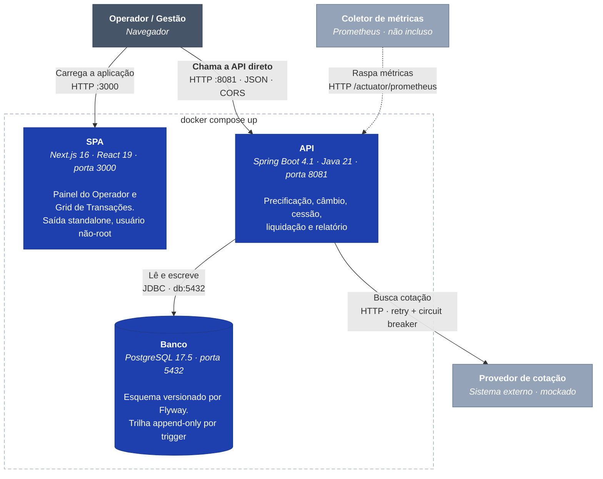
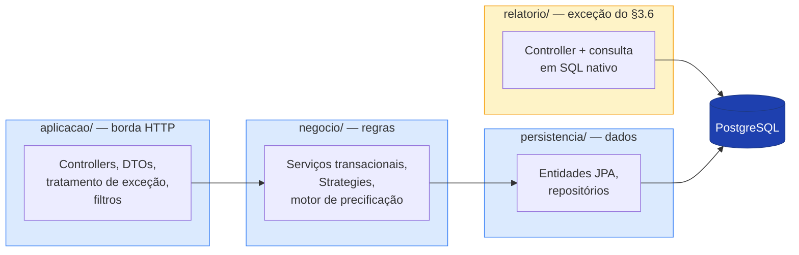

# C4 — Nível 2: Contêineres

O que roda, em que tecnologia, e como as peças conversam.

**Este diagrama reflete o que o `docker-compose.yml` realmente sobe** — três serviços e um volume. Não é uma arquitetura desejada: é a que existe.



## A seta que costuma ser desenhada errada

**O navegador chama a API diretamente. O SPA não é intermediário.**

Todas as chamadas partem de client components — quem fala com a API é o browser do operador, não o contêiner do frontend. Isso tem três consequências concretas:

1. **`NEXT_PUBLIC_API_URL` aponta para `http://localhost:8081`**, a porta publicada no host — e não para `http://api:8081`, que resolveria de contêiner para contêiner e daria erro de DNS na máquina do operador.
2. **A variável é de tempo de _build_**, substituída dentro do bundle. Defini-la no `environment` do Compose não tem efeito nenhum.
3. **CORS existe porque as origens são distintas de verdade.** A lista vem de `APP_CORS_ORIGINS`, sem curinga.

O nome do serviço do Compose **é** usado onde há tráfego entre contêineres: `db:5432`.

A alternativa seria um proxy no Next, fazendo o browser chamar mesma-origem. Foi avaliada e recusada: em produção as origens são mesmo distintas, e o proxy esconderia o problema de CORS no desenvolvimento para revelá-lo no deploy.

## Ordem de subida

```
db  ──healthy──►  api  ──healthy──►  frontend
```

`condition: service_healthy`, não `service_started`. O Flyway roda na subida e falharia contra um Postgres que aceitou a conexão TCP mas ainda está no `initdb`.

O frontend depende da API só para a ordem ser previsível — não há chamada entre eles.

---

# Dentro da API: as três camadas



O fluxo é sempre `aplicacao → negocio → persistencia`. A camada de aplicação **não** alcança a persistência direto — com uma exceção, deliberada e isolada.

## `relatorio/` — a exceção, e por que ela é isolada

O §3.6 do enunciado autoriza a rota de relatório a pular a camada de negócio; o §3.5 trata SQL otimizado como diferencial. As duas decisões precisavam ser **legíveis sem ler o código inteiro**, então o relatório inteiro — controller, consulta e projeções — mora em pacote próprio.

```
ExtratoDeLiquidacaoController  →  ConsultaDeExtrato  →  JdbcClient
```

Não há serviço no meio porque **não há regra a aplicar**: o extrato lê, projeta e pagina. Uma camada de repasse existiria no diagrama e não no comportamento.

Há teste verificando que o controller depende só da consulta. Se um serviço de domínio entrar ali um dia, o teste falha e a decisão volta a ser discutida em vez de erodir em silêncio.

**Por que não JPA:** a consulta cruza quatro tabelas e não corresponde a agregado nenhum. Com ORM seriam duas saídas ruins — uma entidade que existe só para o relatório, ou navegar associações LAZY linha a linha, o N+1 exatamente sobre a consulta que o enunciado descreve como "grandes volumes".

## Duas famílias de Strategy dentro de `negocio/precificacao`

| Família | Resolve | Implementações |
|---|---|---|
| Spread por tipo de recebível | prêmio de risco | Duplicata 1,5% a.m., Cheque 2,5% a.m. |
| Convenção de contagem | prazo → expoente | `ACT_30`, `COMERCIAL_30_360`, `ACT_360`, `ACT_365`, `TAXA_DIARIA`, `BUS_252` |

As duas resolvem por `List<…>` injetada, sem `if` nem `switch`. Tipo desconhecido levanta erro de domínio em vez de assumir zero — spread nulo produziria preço plausível e errado, que é o pior tipo de falha.

## Onde ficam as garantias de integridade

| Garantia | Onde vive |
|---|---|
| Lote entra inteiro ou não entra | `@Transactional` em `ServicoDeCessao` |
| Não há liquidação dupla | Chave de idempotência + `@Version` + `UNIQUE (operacao_id)` |
| Trilha não pode ser alterada | Trigger no PostgreSQL, não convenção |
| Parâmetros reproduzem o cálculo | Congelados como valor **e** como FK em `recebivel` |

A redundância na liquidação é o ponto: a checagem de status sozinha é *time-of-check to time-of-use*. O lock fecha a janela; a constraint cobre o caso de o lock sumir num refactor. Provado com oito threads concorrentes contra o banco real.
