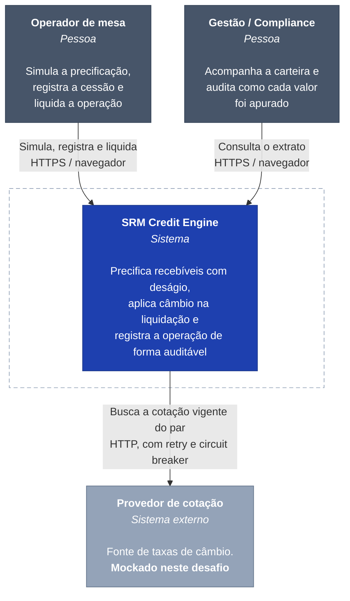

# C4 — Nível 1: Contexto

Quem usa o sistema, com o que ele conversa, e onde ficam as fronteiras.

Este nível responde a uma pergunta só: **o que está dentro e o que está fora do que construímos?** Detalhe de tecnologia é o [nível 2](c4-container.md).

## As duas pessoas são papéis, não usuários cadastrados

O sistema **não tem autenticação** — está fora do escopo do desafio. Os papéis aparecem aqui porque as duas telas atendem a necessidades diferentes: o Painel do Operador é operação, o Grid de Transações é acompanhamento.

Isso tem consequência prática no código: `registradoPor` e `liquidadoPor` são campos **obrigatórios** nas requisições, e não valores derivados de uma sessão. Num sistema com login viriam da autenticação. Aqui são informados, porque uma trilha de auditoria cujo ator é sempre uma constante não audita nada.

## O provedor de cotação é a única dependência externa

E é tratado como dependência que **vai falhar**:

- `@Retry` com backoff exponencial (200 ms, 400 ms, 800 ms) — repetir no mesmo ritmo contra um serviço em recuperação só ajuda a mantê-lo caído;
- `@CircuitBreaker` que abre a 50% de falha numa janela de 10 chamadas, com mínimo de 5;
- timeout de conexão e de leitura explícitos — chamada externa sem timeout transforma lentidão alheia em indisponibilidade própria;
- **degradação**: falhando o provedor, a sincronização devolve a última cotação conhecida com `degradado: true` e status `200`. Devolver `5xx` seria enganoso, porque a requisição foi atendida — com dado do histórico.

A URL padrão aponta para um host inexistente **de propósito**: é o que torna o circuit breaker observável logo após subir o sistema, em vez de exigir um cenário de falha construído.

## O que fica de fora

| Fora do sistema | Por quê |
|---|---|
| Autenticação e autorização | Fora do escopo do desafio. O impacto está registrado acima |
| Liquidação financeira real | O sistema registra a operação; não move dinheiro |
| Fonte de cotação em produção | Mockada. A troca é uma implementação de interface, não uma mudança de arquitetura |
| Coleta de métricas e logs | O sistema **expõe**; quem coleta é infraestrutura — aparece no nível 2 |
