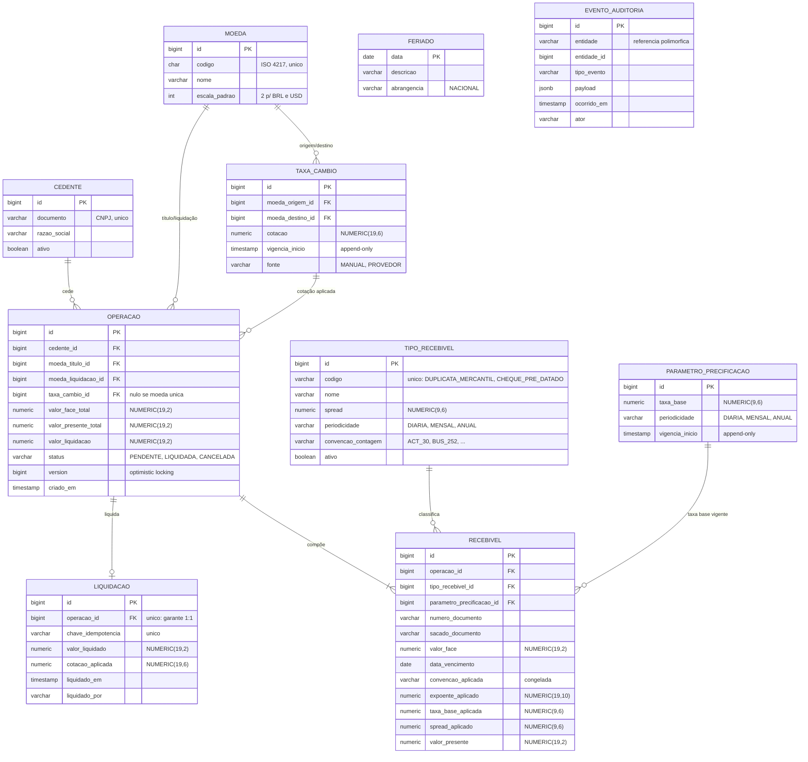
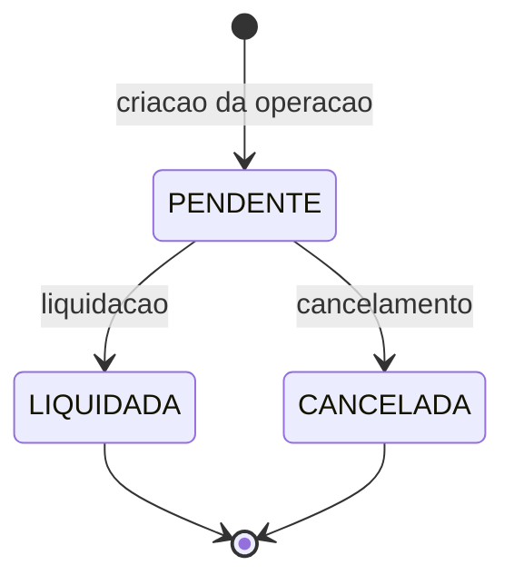

# Modelo de dados

Diagrama ER e dicionário de dados do SRM Credit Engine, atendendo ao §7 do [enunciado](README_case_dev_srm.md).

**Este é o documento definitivo** — extraído da seção 4 de [`backlog.md`](backlog.md) pelo PBI-07; aquela seção ficou congelada como registro da decisão inicial. Mudança de modelo se faz aqui.

O schema é criado por **Flyway** (PBI-08 e PBI-09); o Hibernate roda com `ddl-auto: validate` e apenas confere. O DDL consolidado sai em [`schema.sql`](schema.sql) no PBI-12.

---

## 1. Como o modelo reflete o problema

O §7 pede o relacionamento entre **moedas, produtos, transações e taxas**. No domínio de FIDC isso vira:

| Conceito do enunciado | Tabelas |
|---|---|
| Moedas | `moeda` |
| Produtos (tipos de recebíveis) | `tipo_recebivel` |
| Transações | `operacao`, `recebivel`, `liquidacao` |
| Taxas | `taxa_cambio`, `parametro_precificacao` |

A operação é a unidade de negócio: um cedente vende um **lote** de recebíveis ao fundo. Cada recebível é precificado individualmente — tipo diferente, vencimento diferente, spread diferente — e a operação carrega o total e a liquidação.

---

## 2. Diagrama ER

`FERIADO` e `EVENTO_AUDITORIA` aparecem sem relacionamento **de propósito** — a justificativa está em 3.6.

---

## 3. Princípios de modelagem

As seis decisões abaixo são transversais e explicam a maior parte do dicionário.

### 3.1 Nenhum ponto flutuante, em nenhuma camada

Toda coluna numérica é `NUMERIC`. Nunca `real`, `double precision` ou `float`. Precisão decimal é critério de avaliação nomeado (§8.4), e um `double` no caminho do dinheiro é indefensável independentemente da magnitude do erro.

A correspondência é `NUMERIC` no Postgres ↔ `BigDecimal` no Java, ponta a ponta.

### 3.2 Três escalas, cada uma com um motivo

| Escala | Onde | Por quê |
|---|---|---|
| `NUMERIC(19,2)` | Valores monetários | 2 casas = centavo, unidade mínima de BRL e USD. Precisão 19 mantém aberta a migração para representação inteira em centavos (`long`), caso um dia se queira eliminar decimal do transporte |
| `NUMERIC(9,6)` | Taxas — spread, taxa base | 6 casas porque **taxa entra em exponenciação**: erro de arredondamento na taxa se amplifica no expoente, ao contrário de erro em valor, que fica linear. Precisão 9 comporta taxa até 999,999999 |
| `NUMERIC(19,6)` | Cotação de câmbio | Mercado cota com 4 a 6 casas (a PTAX usa 4); 6 dá margem. Precisão 19 comporta par com moeda de baixo valor unitário |
| `NUMERIC(19,10)` | `expoente_aplicado` | Não é dinheiro nem taxa: é o fator de cálculo, tipicamente uma dízima (`46/252 = 0,1825396825…`). 10 casas preservam a reprodutibilidade da auditoria |

A escala de arredondamento **por moeda** fica em `moeda.escala_padrao`, não hardcoded: BRL e USD usam 2, mas JPY usa 0 e KWD usa 3. Política orientada a dado, não a constante.

### 3.3 Parâmetros temporais são append-only

`taxa_cambio` e `parametro_precificacao` **nunca sofrem `UPDATE`**. Cada mudança insere linha nova com `vigencia_inicio`; a vigente para uma data é a mais recente com `vigencia_inicio <= data`.

Se cotação fosse mutável, reprecificar uma operação de ontem daria resultado diferente do que foi contratado — inaceitável em auditoria. O custo é uma consulta um pouco mais elaborada; o ganho é que o passado não muda.

### 3.4 Todo parâmetro de cálculo é gravado duas vezes: FK e valor

| Onde | FK (linhagem) | Valor congelado (imutabilidade) |
|---|---|---|
| `operacao` | `taxa_cambio_id` | `liquidacao.cotacao_aplicada` |
| `recebivel` | `parametro_precificacao_id` | `taxa_base_aplicada` |
| `recebivel` | `tipo_recebivel_id` | `spread_aplicado`, `convencao_aplicada` |

A FK diz **qual registro** foi usado; o valor diz **quanto ele valia**. Parece redundante e não é: como os parâmetros são append-only mas o *conjunto* pode ganhar linhas, seguir a FK depois responde "de onde veio", enquanto o valor congelado responde "com que número o contrato foi fechado". Auditoria precisa das duas respostas.

### 3.5 Taxa e convenção de contagem são acopladas por unidade

`(1 + taxa)^expoente` só é válido quando o expoente está na mesma unidade de capitalização da taxa. Combinar spread de **1,5% a.m.** com convenção **base 252** (anual) **não lança exceção** — produz preço plausível e errado por ordem de grandeza.

Por isso toda taxa carrega `periodicidade` (`DIARIA`/`MENSAL`/`ANUAL`) e cada convenção declara a unidade que produz. O motor valida o par antes de calcular e recusa combinação incompatível como erro de negócio (risco R7 do backlog).

Consequência no schema: `spread` e `taxa_base` **não** se chamam `spread_mensal`/`taxa_base_mensal`. A unidade é dado, não nome de coluna.

O recebível congela `convencao_aplicada` e `expoente_aplicado` em vez de `prazo_meses`: com convenções múltiplas, "prazo em meses" deixa de ser representação suficiente, porque o mesmo intervalo de datas produz expoentes diferentes conforme a convenção.

### 3.6 Duas tabelas sem relacionamento, de propósito

**`feriado`** é consultada pela convenção `BUS_252` para contar dias úteis — é tabela de calendário, não entidade do domínio. Ligá-la por FK a qualquer coisa não faria sentido.

**`evento_auditoria`** usa referência polimórfica (`entidade` + `entidade_id`) em vez de FK. É uma troca deliberada: perde-se integridade referencial declarativa, ganha-se uma trilha única que cobre qualquer entidade sem precisar de uma tabela de auditoria por tabela auditada. Para trilha append-only, cuja finalidade é registro e não navegação, a troca compensa.

---

## 4. Dicionário de dados

Convenções: `PK` chave primária, `FK` estrangeira, `UK` única. Todas as `id` são `BIGSERIAL`.

### `moeda`

| Coluna | Tipo | Nulo | Regra |
|---|---|---|---|
| `id` | `BIGSERIAL` | não | PK |
| `codigo` | `CHAR(3)` | não | UK. ISO 4217 — `BRL`, `USD` |
| `nome` | `VARCHAR(60)` | não | Nome por extenso |
| `escala_padrao` | `SMALLINT` | não | Casas decimais da moeda. `CHECK BETWEEN 0 AND 4` |

### `cedente`

| Coluna | Tipo | Nulo | Regra |
|---|---|---|---|
| `id` | `BIGSERIAL` | não | PK |
| `documento` | `VARCHAR(14)` | não | UK. CNPJ só com dígitos — formatação é da apresentação |
| `razao_social` | `VARCHAR(200)` | não | |
| `ativo` | `BOOLEAN` | não | `DEFAULT true`. Cedente inativo não origina operação nova; operações antigas permanecem |

### `tipo_recebivel`

| Coluna | Tipo | Nulo | Regra |
|---|---|---|---|
| `id` | `BIGSERIAL` | não | PK |
| `codigo` | `VARCHAR(40)` | não | UK. `DUPLICATA_MERCANTIL`, `CHEQUE_PRE_DATADO`. É a chave que resolve a Strategy de spread |
| `nome` | `VARCHAR(80)` | não | |
| `spread` | `NUMERIC(9,6)` | não | Prêmio de risco. `CHECK >= 0`. Duplicata `0.015`, cheque `0.025` |
| `periodicidade` | `VARCHAR(10)` | não | `CHECK IN ('DIARIA','MENSAL','ANUAL')`. Ver 3.5 |
| `convencao_contagem` | `VARCHAR(20)` | não | Convenção padrão do produto. `CHECK` contra os códigos suportados |
| `ativo` | `BOOLEAN` | não | `DEFAULT true` |

> O **valor** do spread vive aqui, para ajuste sem deploy. A **regra** de derivação vive na Strategy correspondente (PBI-18). É essa separação que impede o padrão de virar um `Map` disfarçado.

### `parametro_precificacao`

| Coluna | Tipo | Nulo | Regra |
|---|---|---|---|
| `id` | `BIGSERIAL` | não | PK |
| `taxa_base` | `NUMERIC(9,6)` | não | Custo de oportunidade do fundo. `CHECK >= 0` |
| `periodicidade` | `VARCHAR(10)` | não | `CHECK IN ('DIARIA','MENSAL','ANUAL')` |
| `vigencia_inicio` | `TIMESTAMPTZ` | não | Append-only (3.3). Vigente = maior `vigencia_inicio <= data` |

### `taxa_cambio`

| Coluna | Tipo | Nulo | Regra |
|---|---|---|---|
| `id` | `BIGSERIAL` | não | PK |
| `moeda_origem_id` | `BIGINT` | não | FK → `moeda` |
| `moeda_destino_id` | `BIGINT` | não | FK → `moeda`. `CHECK <> moeda_origem_id` |
| `cotacao` | `NUMERIC(19,6)` | não | Unidades de destino por unidade de origem. `CHECK > 0` — zero ou negativo não é cotação |
| `vigencia_inicio` | `TIMESTAMPTZ` | não | Append-only (3.3) |
| `fonte` | `VARCHAR(20)` | não | `CHECK IN ('MANUAL','PROVEDOR')`. Distingue atualização humana de integração (PBI-15) |

### `operacao`

| Coluna | Tipo | Nulo | Regra |
|---|---|---|---|
| `id` | `BIGSERIAL` | não | PK |
| `cedente_id` | `BIGINT` | não | FK → `cedente` |
| `moeda_titulo_id` | `BIGINT` | não | FK → `moeda`. Moeda de emissão dos títulos |
| `moeda_liquidacao_id` | `BIGINT` | não | FK → `moeda`. Diferente da anterior ⇒ operação cross-currency |
| `taxa_cambio_id` | `BIGINT` | **sim** | FK → `taxa_cambio`. Nulo quando as moedas coincidem. `CHECK`: não-nulo se e somente se `moeda_titulo_id <> moeda_liquidacao_id` |
| `valor_face_total` | `NUMERIC(19,2)` | não | Soma dos `recebivel.valor_face`. `CHECK > 0` |
| `valor_presente_total` | `NUMERIC(19,2)` | não | Soma dos `recebivel.valor_presente`, na moeda do título. `CHECK > 0` |
| `valor_liquidacao` | `NUMERIC(19,2)` | não | Valor presente após conversão cambial, na moeda de liquidação. Igual ao anterior quando moeda única |
| `status` | `VARCHAR(15)` | não | `CHECK IN ('PENDENTE','LIQUIDADA','CANCELADA')` |
| `version` | `BIGINT` | não | `DEFAULT 0`. `@Version` do JPA — optimistic locking da liquidação (PBI-28) |
| `criado_em` | `TIMESTAMPTZ` | não | `DEFAULT now()` |

> **Deságio** não tem coluna: é `valor_face_total − valor_presente_total`, derivado. Guardar dado derivado convida à divergência.

### `recebivel`

| Coluna | Tipo | Nulo | Regra |
|---|---|---|---|
| `id` | `BIGSERIAL` | não | PK |
| `operacao_id` | `BIGINT` | não | FK → `operacao`, `ON DELETE CASCADE` — recebível não existe fora do lote |
| `tipo_recebivel_id` | `BIGINT` | não | FK → `tipo_recebivel` |
| `parametro_precificacao_id` | `BIGINT` | não | FK → `parametro_precificacao`. Linhagem (3.4) |
| `numero_documento` | `VARCHAR(50)` | não | Número da duplicata ou do cheque |
| `sacado_documento` | `VARCHAR(14)` | não | CPF ou CNPJ do devedor original |
| `valor_face` | `NUMERIC(19,2)` | não | `CHECK > 0` |
| `data_vencimento` | `DATE` | não | `DATE`, não `TIMESTAMP` — vencimento é dia, não instante |
| `convencao_aplicada` | `VARCHAR(20)` | não | Congelada (3.5) |
| `expoente_aplicado` | `NUMERIC(19,10)` | não | Congelado. `CHECK >= 0` |
| `taxa_base_aplicada` | `NUMERIC(9,6)` | não | Congelada |
| `spread_aplicado` | `NUMERIC(9,6)` | não | Congelado |
| `valor_presente` | `NUMERIC(19,2)` | não | `CHECK > 0` e `CHECK <= valor_face` — deságio nunca é negativo |

### `liquidacao`

| Coluna | Tipo | Nulo | Regra |
|---|---|---|---|
| `id` | `BIGSERIAL` | não | PK |
| `operacao_id` | `BIGINT` | não | FK → `operacao`. **`UNIQUE`** — é o banco, não o código, que impede liquidação dupla |
| `chave_idempotencia` | `VARCHAR(64)` | não | `UNIQUE`. Retry do cliente devolve o resultado original em vez de duplicar (PBI-28) |
| `valor_liquidado` | `NUMERIC(19,2)` | não | Na moeda de liquidação. `CHECK > 0` |
| `cotacao_aplicada` | `NUMERIC(19,6)` | **sim** | Nulo quando moeda única. Valor congelado (3.4) |
| `liquidado_em` | `TIMESTAMPTZ` | não | `DEFAULT now()` |
| `liquidado_por` | `VARCHAR(80)` | não | Ator informado. Não há autenticação no escopo (premissa P2 do backlog) |

### `feriado`

| Coluna | Tipo | Nulo | Regra |
|---|---|---|---|
| `data` | `DATE` | não | PK — a própria data é a chave |
| `descricao` | `VARCHAR(80)` | não | |
| `abrangencia` | `VARCHAR(20)` | não | `CHECK IN ('NACIONAL')`. Só nacional no escopo; municipal fora (premissa P7) |

### `evento_auditoria`

| Coluna | Tipo | Nulo | Regra |
|---|---|---|---|
| `id` | `BIGSERIAL` | não | PK |
| `entidade` | `VARCHAR(40)` | não | Nome lógico — `OPERACAO`, `LIQUIDACAO` |
| `entidade_id` | `BIGINT` | não | Referência polimórfica, sem FK (3.6) |
| `tipo_evento` | `VARCHAR(40)` | não | `OPERACAO_CRIADA`, `OPERACAO_LIQUIDADA` |
| `payload` | `JSONB` | não | Estado relevante no momento. Sem credencial e sem dado desnecessário |
| `ocorrido_em` | `TIMESTAMPTZ` | não | `DEFAULT now()` |
| `ator` | `VARCHAR(80)` | não | |

> Append-only: sem `UPDATE` e sem `DELETE`. Participa da mesma transação da operação — não existe evento órfão nem operação sem evento.

---

## 5. Índices

> **O Postgres não cria índice automático para chave estrangeira** — só para `PRIMARY KEY` e `UNIQUE`. Os índices de FK abaixo são explícitos por isso.

| Índice | Colunas | Serve a |
|---|---|---|
| `ix_taxa_cambio_par_vigencia` | `(moeda_origem_id, moeda_destino_id, vigencia_inicio DESC)` | "Cotação vigente na data" — o `DESC` deixa a resposta na primeira linha |
| `ix_parametro_vigencia` | `(vigencia_inicio DESC)` | Idem para taxa base |
| `ix_operacao_cedente_criado` | `(cedente_id, criado_em)` | Filtro de período e cedente do Extrato (PBI-35) |
| `ix_liquidacao_liquidado_em` | `(liquidado_em)` | Filtro de período do Extrato |
| `ix_recebivel_operacao` | `(operacao_id)` | FK sem índice automático |
| `ix_evento_entidade` | `(entidade, entidade_id)` | Consulta da trilha por entidade |

Os índices definitivos do relatório saem do `EXPLAIN ANALYZE` do PBI-36, medidos sobre massa real. Os acima são o mínimo estrutural, não o resultado de tuning.

---

## 6. Ciclo de vida da operação

`LIQUIDADA` e `CANCELADA` são terminais. Só `PENDENTE` aceita liquidação — tentar liquidar operação já liquidada ou cancelada devolve `409 Conflict`, não `500`.

A transição para `LIQUIDADA` é protegida por três defesas deliberadamente redundantes (PBI-28): `version` para optimistic locking, `UNIQUE (operacao_id)` em `liquidacao`, e chave de idempotência.

---

## 7. Fora de escopo

Declarado para que a ausência não pareça esquecimento:

- **Sem tabela de usuário.** O enunciado não pede autenticação; `liquidado_por` e `ator` guardam o identificador informado (premissa P2).
- **Sem soft delete.** Cancelamento é status; auditoria é append-only. Nada é apagado, então não há o que marcar como apagado.
- **Sem multi-tenant.** Um fundo, um schema.
- **Sem particionamento.** Cabe no design de alta escala, que é entregável 🟣 Especialista e está fora de escopo.

---

## 8. Rastreabilidade

| Requisito | Onde é atendido |
|---|---|
| §7.1 — Diagrama ER com moedas, produtos, transações e taxas | Seções 1 e 2 |
| §7.2 — Scripts DDL | [`schema.sql`](schema.sql), gerado no PBI-12 |
| §3.3 — Persistência relacional e ACID | Seção 6 e as três defesas da liquidação |
| §8.4 — Precisão numérica | Seções 3.1 e 3.2 |
| §8.4 — Segurança transacional | `version`, `UNIQUE (operacao_id)`, idempotência |

As migrações do PBI-08 e PBI-09 devem conferir com este documento. `ddl-auto: validate` garante que as entidades JPA (PBI-11) não divirjam do que o Flyway criou; a correspondência entre este documento e o Flyway é verificada na revisão daqueles PRs.
